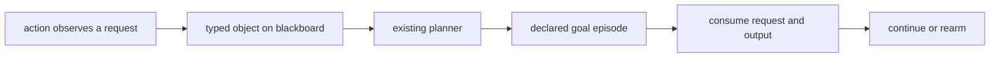

# GitHub Issue Draft: Evolving Mode Essentials

> **Status: canonical long-form proposal and sub-issue drafts.** The shorter
> body posted as issue #1756 is the maintainer-facing summary. This document
> preserves implementation detail and incorporates the baseline behavior tests
> and subsequent maintainer discussion.

Draft issue text for the post-1.0.0 Evolving Mode discussion.

Discussion context: https://github.com/embabel/embabel-agent/discussions/1725

### Title

Evolving Mode

### Body

Embabel Agent already replans as actions add typed objects to the blackboard, and existing goals can become achievable during a running process. What's missing is an explicit goal lifecycle for work that should complete without ending the process and become eligible again for a later occurrence.

I've coined 2 terms:

- **Deterministic Evolving**: a runtime fact drives a known declared goal episode to completion without ending the process, and a later fact can run it again. The connection is typed and known ahead of time.
- **Open Evolving**: not every fact-to-goal connection can be wired ahead of time. An `ObjectiveAuthor` can propose a validated policy revision when the predefined policy cannot handle what the process discovers.

My read on Evolving Mode is that declared agent metadata should remain immutable, existing planners should be reused, and no new `PlannerType` is needed.

The core loop is:



### Motivation

The README describes Evolving Mode as working with multiple goals in one process and modifying a running process to add further goals and agents. Its example says an action can realize that additional goals have become important.

Current Embabel already covers more of that sentence than I initially understood. An action can add an object to the blackboard, a declared goal requiring that object becomes plannable, and GOAP or HYBRID can pursue it at the next planning tick. The missing deterministic infrastructure is the lifecycle around that goal completion:

- completing selected side work should not complete the process;
- its triggering request and satisfying output must not keep the goal satisfied forever;
- a later request should be able to run the same episode again.

The [baseline tests](https://github.com/Stuckya/embabel-agent/blob/goal-episode-baseline-tests/embabel-agent-api/src/test/kotlin/com/embabel/plan/GoalEpisodeBaselineTest.kt) demonstrate both the existing behavior and these gaps under GOAP and HYBRID.

The more emergent reading of the README arrives later through Open Evolving: validated objective-policy revision when no predefined connection covers a discovered need. The "and agents" half is process-local scope expansion using already-declared `@Agent` or `@EmbabelComponent` instances.

A `@Condition` remains the right model for current truth. Evolving episodes are for selected facts that represent a unit of follow-up work to handle once. The framework should own that completion and rearm bookkeeping rather than require lifecycle-only actions, manual blackboard hiding, and value tuning in each consumer application.

### Proposed Work Streams

As discussed in #1725, I've split this into work streams. They do not have to be strictly sequential, but the first is the smallest working slice and should stand on its own.

1. Nonterminal repeatable episodes from internally observed facts
2. External fact ingress and automatic wake
3. Observability support
4. Cooperative interruption of the running action
5. Open Evolving: `ObjectiveAuthor` re-authoring at a planning tick
6. Process-local scope expansion
7. Recurring goal episodes for native pure-GOAP standing work; event-driven waiting ships with ingress (2)
8. Example application

### Motivating Example

A concrete event-driven process might have a long-running objective such as:

```text
As a robot, collect samples in Zone A until 500 samples are stored.
```

The process runs over scoped capability or agent instances:

- sample collection
- robot navigation
- sample storage
- sensor calibration

The traditional Embabel pieces:

- declared actions handle collection, navigation, and storage
- declared goals are satisfied by normal action outputs such as `SamplesStored`
- conditions and values still control availability and action selection

For example, `sampleTrayFull` is ongoing state. It stays true while the robot's sample tray is full and becomes false after the samples are stored. It should be modeled with `@Condition` and action preconditions, not as a runtime goal:

```java
@Condition(name = "sampleTrayFull")
boolean sampleTrayFull(SampleTraySnapshot tray) {
    return tray.count() >= tray.capacity();
}

@Action(pre = "sampleTrayFull")
AtStorage navigateToStorage(CurrentLocation current, StorageLocation storage) {
    // navigate to the storage area
}
```

In this example, `sampleTrayFull` only gates whether storage/navigation actions are available. Evolving Mode is not involved merely because the tray is full.

Deterministic Evolving takes over when a selected typed fact represents known follow-up work this run should handle once:

- `SensorCalibrationRequested`

Other progress facts can remain ordinary blackboard facts that terminal goals, conditions, or actions read:

- `SampleCollected`
- `SamplesStored`

The smallest illustrative API adds episode lifecycle through the existing `ProcessOptions` pattern. The new names are placeholders; the infrastructure is the point:

```java
var options = ProcessOptions.DEFAULT
    .withPlannerType(PlannerType.HYBRID)
    .withEpisodes(EpisodePolicy
        .episode(GoalTarget.output(SensorCalibrationCompleted.class))
            .consumeOnCompletion(SensorCalibrationRequested.class));

var agent = AgentScopeBuilder.fromInstances(
        new SampleCollection(),
        new Navigation(),
        new SampleStorage(),
        new Calibration())
    .createAgentScope()
    .createAgent(
        "sample-collection",
        "example",
        "Long-running sample collection");

// A declared condition-gated terminal goal retains existing
// goal-completes-process behavior at samplesStored >= 500.
var process = agentPlatform.createAgentProcessFrom(
    agent,
    options,
    new CollectSamples("Zone A", 500));

agentPlatform.start(process);
```

Everything in this sketch except `withEpisodes`, `EpisodePolicy`, and `GoalTarget` exists on main today.

During phase 1, an action observes the calibration request and adds `SensorCalibrationRequested` through `ActionContext`, or through `ReplanRequestedException.blackboardUpdater` when it must abandon its current path. External `process.ingress().publish(...)` is phase 2.

`ProcessOptions.withEpisodes(...)` is the Phase 1 core. Existing invocation paths already accept `ProcessOptions`, so they can support episodes without a new invocation type. A later `EvolvingInvocation` may provide syntactical sugar over the same options for objective authoring or scope assembly.

An empty episode policy preserves today's behavior exactly. Supplying `ProcessOptions.withEpisodes(...)` enables Deterministic Evolving; supplying a later `ProcessOptions.withObjectiveAuthor(...)` enables Open Evolving. These are auditable process options, not planner modes.

Because episodes live in `ProcessOptions`, they also compose with Autonomy/Open and every other path that creates a process with options. The selected or assembled agent remains responsible for scope. Episode targets are validated against that actual agent when the process is created; there is no mode-compatibility matrix.

`EpisodePolicy` does not teach the planner how to discover or pursue the goal. The existing planner already does that. It identifies goal completions that are nonterminal episodes and owns their consume/rearm lifecycle. Ordinary terminal goals retain today's behavior. Selection remains with existing conditions and plan values.

### Phase 1 API Surface

The complete deterministic phase-1 surface, gathered in one place. Spellings are placeholders (see Open Questions); the shape is the contract.

```java
// The substrate is data. The fluent EpisodePolicy.episode(...) chain is sugar over it.
record Episode(
    GoalTarget target,   // one or more candidate declared goals
    Class<?> consumes    // the request occurrence this episode consumes
) {}

record EpisodePolicy(List<Episode> episodes) {}

// The single new entry point, following the existing ProcessOptions wither pattern
ProcessOptions withEpisodes(EpisodePolicy episodes);

// Target references, canonicalized against the active scope at process creation
GoalTarget.output(Class<?> satisfiedByType)  // all scoped declared goals satisfied by that type
GoalTarget.named(String goalName)            // exactly one declared goal by stable identity
```

Surface rules, gathered from the sections below:

- `consumeOnCompletion(Request.class)` is the documented default. A bare `episode(target)` may infer the consumed request only when the goal path has exactly one off-chain input — an input the planner cannot manufacture from any scoped action's effects; otherwise configuration fails fast. Inference cannot decide whether a single off-chain input is an occurrence or a standing fact, so the explicit form stays preferred.
- Nonterminal completion and consumption are one contract, never two switches.
- An empty policy preserves today's behavior exactly.
- Recognition point: `SimpleAgentProcess.handleProcessCompletion(...)`, already shared by simple and concurrent processes.

Not phase 1: `ingress()` (phase 2, Sub-Issue 2), an `interruptsCurrentAction` episode field (phase 4 adds it), `withObjectiveAuthor(...)` (phase 5), `recurring(...)` (work stream 7).

### Runtime Semantics

The existing type, condition, binding, goal, and planner model remains authoritative. A request object can make one or more declared goals plannable today. Episode policy changes what happens when a selected candidate goal is satisfied; it does not maintain a second goal set or add a planner overlay for deterministic phase 1.

An episode is one bounded plan-execute-complete cycle. It is not an atomic block: per-tick replanning can interleave standing work between its steps when values favor it (baseline test 10). On completion of an episode goal, the exact triggering fact occurrence and every product the episode's chain manufactured — the satisfying output and any intermediates, found by walking the goal's producing actions — are hidden through the existing blackboard API. Nothing is deleted; the blackboard remains append-only. Hiding makes the goal unsatisfied and its chain unreplannable from leftovers, so a later occurrence plans the entire chain fresh. A self-maintained fact — a type some action both consumes and produces, such as a tally the action increments — is never an episode product and survives completion.

The lifecycle is per occurrence and the declared goal is reusable. Completing an episode never completes the process. Ordinary declared goals keep today's behavior and may complete the process.

Nonterminal completion and consumption are one contract. They should not be separate switches: a nonterminal goal that leaves its request or satisfying output visible remains satisfied, so its empty plan can immediately compete again.

`GoalTarget.output(T)` may identify several declared candidate goals satisfied by `T`; normal conditions, heuristics, and plan values choose among them. The first completion finishes the episode. A target with no scoped producer fails fast. The exact target representation remains an API-design question.

The phase-1 implementation should not introduce keyed goal-instance satisfaction. Domains needing key-specific behavior should use existing types, conditions, bindings, and action inputs. Episode rearm rides the existing `canRerun` contract: the framework does not reset execution state, and an episode whose completing action declares `canRerun = false` is deliberately one-shot.

### Blackboard Model

In my own project, I've treated the blackboard as process-local working memory for an `AgentProcess`. Not a mutable world-state database. Not a pub/sub bus. Not an external-event ingestion mechanism. (To be transparent: docs describe it as "the shared memory system that maintains state throughout the agent process execution" and show direct `blackboard.add(...)` in examples. The framing here is the position this proposal takes on what external ingress must preserve, not a quote of existing documentation.)

From our Motivating Example, Embabel should probably not own domain state like tray contents, inventory, or sensor snapshots. The consumer application owns those modules. Embabel consumes `@Condition`, action inputs, scoped capabilities, selected request facts, and episode/objective policy. A `@Condition` can read current truth from those modules directly. Current state does not need to be republished to the blackboard as facts, and high-frequency or reversible state stays outside Evolving Mode entirely.

Internally, actions already use `ActionContext` and ordinary Embabel execution to add objects. For external callers, selected facts should enter through a sanctioned process-local ingress API that queues publication for a planning tick rather than exposing unsynchronized blackboard mutation.

### Relationship To `@Action(trigger = ...)`

I'd keep `@Action(trigger = X.class)` as an action-level reactive feature. It is useful when `X` is the latest result and the triggered action can run directly. It does not queue or identify occurrences, and it provides no consume/rearm lifecycle; those remain ordinary action and blackboard behavior.

I don't think it should be the Evolving Mode mechanism. `trigger` is based on `lastResult`, so it is fragile as a step inside a forward GOAP plan:

- a prefix action can overwrite `lastResult` before the triggered action runs.
- a planner that needs a complete static path cannot route through a trigger action whose event is not already the latest result.

The boundary could be:

- use `@Action(trigger = X.class)` for simple reactive handlers where no planner-visible lifecycle is needed.
- use episode lifecycle when a typed request should drive a declared goal to completion, consume its request/output, and allow the process to continue.

An `@OccurrenceFact`-style marker was considered and rejected. It would put Embabel lifecycle semantics on domain types and make a goal's completion behavior depend on how the goal was reached. Episode policy keeps that behavior explicit on the process. In short: `trigger` covers latest-result, single-action reactions; episodes cover planned handling with once-per-occurrence lifecycle and nonterminal completion.

### Relationship To `ReplanRequestedException`

Evolving Mode should compose with the existing `ReplanRequestedException`, not introduce another action-initiated replanning mechanism. If an action or tool observes a request while abandoning its current path, it can throw `ReplanRequestedException` with a `BlackboardUpdater` that adds the object. The process applies the update, remains `RUNNING`, and the existing planner sees the newly plannable goal at the next planning tick.

`ReplanRequestedException` does not provide episode lifecycle. It provides the existing "yield, update the blackboard, and replan" path from inside action execution.

External ingress is different. A publisher runs outside the action execution stack and cannot throw an exception into the process. Phase 2 therefore still needs an explicit wake mechanism, but both paths converge on the same planning-tick processing and existing planner.

### Cooperative Interruption

Making a new response goal plannable changes what the planner may select at the next planning tick. It does not interrupt an action that is already executing. Consumers with long or blocking actions should not have to split them into planning-tick-sized steps to stay responsive to urgent facts.

For urgent external facts, a later phase may add `.terminateCurrentAction()`: request graceful interruption through the existing `AgentProcess.terminateAction` machinery, then let normal planning choose the response after the action yields. No threads are killed, and an action that cannot observe cancellation runs to completion.

### Episode Matching and Rearm Semantics

The phase-1 contract is deliberately concrete. `consumeOnCompletion(Request.class)` identifies the request consumed by the episode. When a candidate goal completes, the framework hides the exact request object and the chain's products: the satisfying output and any intermediates manufactured on the goal path. A later distinct request object therefore replans the same episode from scratch — a stale intermediate cannot shortcut it. Consumption follows the plannability boundary: what the chain manufactured is consumed, while everything the path merely read — other off-chain inputs and self-maintained facts — survives. Product cleanup is conservative static analysis: it hides by type across the candidate's possible producer paths rather than tracking what this completion manufactured. A visible product of an alternative path is planning bait the planner may legitimately route through, so types manufactured on an episode chain should not double as standing data. A resource that should outlive episodes is therefore an off-chain input, not a declared product. When several occurrences are visible at completion, the latest visible one is consumed, matching the default binding the completing action received.

The first implementation should reject configurations where one request type ambiguously owns several independent episode definitions, and likewise where two episodes resolve to the same declared goal. One episode target may still resolve to several declared candidate goals; they are alternative ways to complete the same episode, not fan-out. Consumption is scoped to the candidate that completed; another candidate's products are untouched.

Consumption is resolved statically at process creation — by walking the same condition graph the planner searches, so chain membership follows the planner's own assignability rules — and applied through `Blackboard.hide` at completion; there is no per-occurrence tracking and no consumer-facing activation API. Hiding is equality-based on main: distinct-but-equal request payloads coalesce, and one completion consumes all of them. Occurrence identity is therefore the consumer's responsibility — give requests distinguishing state such as an id or a timestamp. The observable contract is consume once, do not complete the process, and allow a later occurrence to run again.

### Completion And Waiting

Episode goals are the nonterminal exception. Ordinary declared goals retain existing goal-completes-process behavior, so a condition-gated mission goal can still end the sample-collection process at 500 stored samples.

An optional `CompletionPolicy` may later provide invocation-level ergonomics for objectives that do not map cleanly to one declared terminal goal. It is not required for the phase-1 episode lifecycle.

Waiting itself already exists. An action can call the existing `waitFor(awaitable)`: it declares the awaited type as its return type so the planner can route through it, the process parks `WAITING` with the awaitable on the blackboard, and `Awaitable.onResponse` plus `run()` resumes it. The baseline tests show both halves: a `STUCK` GOAP process resumes manually after `addObject` and `run()`, and a `waitFor` action parks `WAITING` instead of `STUCK` and resumes straight into the goal. What is missing is only the wake — the resume is driver-owned today. That contract ships with external ingress (phase 2). Waiting permits externally driven episodes; it does not make pure GOAP execute standing work on its own (that is work stream 7).

### Objective Author Relationship

I see two useful evolving shapes:

- **Deterministic Evolving** — existing invocation paths receive an episode policy through `ProcessOptions`. The policy identifies known declared goals whose completion should be nonterminal and repeatable for configured request types.
- **Open Evolving** — a later `ProcessOptions.withObjectiveAuthor(...)` may use Open-style deliberation to author an `ObjectivePolicy`. An optional `EvolvingInvocation` can provide fluent sugar over the same option. It is the generic re-authoring mechanism for what no predefined rule covers: an unknown blocker, no viable plan, or unresolved runtime facts at a planning tick. It should not require predeclared per-type hooks like `.onUnhandledFact(X.class)`. That would just be Deterministic Evolving with extra steps.

This should follow Open mode's discipline: LLM-backed authoring can rank or select among declared scoped goals and propose objective-specific policy, but execution only uses validated scope objects.

An `ObjectiveAuthor` should author typed objectives or objective policies. Those policies may identify episode goals, completion rules, and runtime goal or scope revisions. The framework validates the authored policy against the active scope before installation: at launch for initial policy and at a planning tick for Open Evolving revisions.

Open mode and Open Evolving use the same kind of authoring judgment and the same declared-goal boundary. Open mode selects before running a process; Open Evolving revises policy at a planning tick in the same running process.

> [!NOTE]
> I think Open-style authoring should stay outside the hot loop. Runtime actions emit typed facts rather than inventing new goals.

### Policy Sources

Policy reaches a process from two places:

- **Base policy**: installed by the consumer application through `ProcessOptions`, such as recovery and episode lifecycle rules.
- **Objective policy**: authored for a particular run, such as objective-specific episodes, completion rules, utility defaults, and initial facts.

The `ObjectiveAuthor` should not need to remember universal safety and recovery rules. A launch-time validation step should merge base policy and objective policy, canonicalize all goal targets against scope, and reject the merged policy if any required handler has no scoped producing capability.

### Open questions

Maintainer input would be helpful on these decisions.

- **Does the immutable-declared interpretation match the README's intent?**
- **Reuse existing planners, or a new planning mode?** Deterministic phase 1 changes goal-completion lifecycle, not planner search or goal discovery. Open Evolving and scope expansion may change process-local policy or scope later, but GOAP/Utility/Hybrid remain the execution planners.
- **Which method name spellings should ship?** `EpisodePolicy`, `withEpisodes`, `episode`, `consumeOnCompletion`, and `ingress()` are illustrative. Phase 1 should follow the existing immutable `ProcessOptions` wither pattern; the exact type and method names remain open.
- **How should candidate targets be represented in the final API?** The examples use an illustrative `GoalTarget.output(SensorCalibrationCompleted.class)` shape. All scoped declared goals satisfied by that output type become candidates for one episode; existing conditions and planner selection choose among them. `GoalTarget.named("sensorCalibrationCompleted")` selects one declared goal explicitly. Either form is canonicalized against the active scope; the exact target type and spelling remain open.
- **Should `Blackboard.hide` gain identity semantics?** Hiding is equality-based today, so distinct-but-equal request payloads coalesce under consumption. Phase 1 documents this and leaves occurrence identity to request state; identity-based hiding would be a platform change with impact beyond episodes.
- **Can `withObjectiveAuthor(...)` and an explicit episode policy be supplied together and merged into one validated `ObjectivePolicy`, or is supplying both rejected?**

### Additional Context

> [!NOTE]
> Disclosure: This section was fully generated by Claude while I was vetting this spec. I found it helpful in staying consistent during research, so I left it and collapsed it by default.

<details>
<summary><strong>Vocabulary Key</strong> — the terms this issue leans on, defined once</summary>

- **Declared capability** - immutable `@Agent` and `@EmbabelComponent` actions, conditions, and goals.
- **Consumer application** - the application using Embabel, configuring invocation, providing scoped capabilities, owning domain state modules, and publishing selected external facts.
- **Request fact** - typed domain object on the blackboard that represents one occurrence of follow-up work. Not a new public `Fact` API.
- **Episode / goal episode** - one bounded plan-execute-complete cycle toward an existing declared goal. Episode completion is nonterminal and rearms after its request and chain products are consumed. An episode is not an atomic block: per-tick replanning can interleave standing work between its steps (baseline test 10). Work stream 7 explores recurring episodes for pure-GOAP standing work.
- **Runtime goal** - reserved here for a process-local objective proposed later by Open Evolving or scope expansion. Deterministic phase 1 reuses declared goals rather than adding a second goal set.
- **Deterministic Evolving** - predeclared episode lifecycle for known request types and known declared goals.
- **Open Evolving** - an `ObjectiveAuthor` authors or revises the objective policy when predefined episode policy and scope cannot handle the situation. It proposes goal references as typed data, never executable code. Proposed goals use the same scope validation and may opt into the same nonterminal lifecycle.
- **Planning tick** - the boundary where the process plans: after an action completes, when a wake re-drives a parked process, or when the consumer's driver ticks. Ingress drains, newly visible requests may make declared goals plannable, and `@Condition` state is re-read. A tick replans from current state; the first implementation has no plan cache.
- **Fact occurrence** - the exact request object added to the blackboard. Phase 1 consumes that occurrence through existing `Blackboard.hide` behavior, which is equality-based: equal payloads coalesce, so requests should carry distinguishing state.
- **Off-chain input** - an input the planner cannot manufacture from any scoped action's effects: seeded at process creation, observed mid-run through `ActionContext`, or arriving through phase-2 ingress. The planner cannot manufacture it, and episode completion never consumes it — except the configured request occurrence, which is itself off-chain. Unrelated to `@State`, which groups action availability.
- **Application-owned state module** - consumer-owned state such as sensor snapshots, tray contents, inventory, or connection/session state. Embabel should consume this through action inputs, `@Condition`, scoped capabilities, and selected occurrence facts, not own the whole state model.

</details>

<details>
<summary><strong>Decision Guide</strong> — which primitive fits which situation</summary>

| Situation | Prefer | Example |
| --- | --- | --- |
| The planner needs current truth. | `@Condition` or action input | `sampleTrayFull`, `doorOpen`, `hazardVisible` |
| An action should only run while current truth holds. | `@Condition` + `@Action(pre = ...)` | `navigateToStorage` only when `sampleTrayFull` |
| A fact reveals known follow-up work that should complete without ending the process. | Deterministic Evolving episode | `SensorCalibrationRequested -> SensorCalibrationCompleted` |
| An episode's steps depend on current truth. | Episode lifecycle + `@Condition` | Calibration actions gated by `atMaintenanceBay` |
| Known follow-up work is urgent and the current action should yield. | Episode lifecycle + cooperative `terminateAction` integration | An urgent recovery request cancelling an in-flight navigation action |
| A user asks for a broad objective before the process starts. | `ObjectiveAuthor` / `ObjectivePolicy` supplies the launch-time objective policy | "Collect samples in Zone A until 500 are stored, and run a sensor calibration check every hour" |
| The run discovers an unknown blocker or has no viable plan. | Open Evolving: `ObjectiveAuthor` re-authoring at a validated planning tick | `ZoneAccessBlocked(missingRequirement = Permit("P-42"))` -> propose runtime goal `PermitObtained` with a typed target |
| A reaction should fire off the latest result, no lifecycle needed. | `@Action(trigger = X.class)` | A notification action firing when `X` was just produced |
| The process must wait for a solicited external response. | Existing `waitFor` / `Awaitable` | An action promising `SensorCalibrationRequested` parks `WAITING` until the response arrives |
| Work needs explicit phases scoping which actions are available. | `@State`; composes with episodes | Calibration actions available, storage actions not, while calibration is in flight |
| The only reason is "an event happened." | Usually not enough for Evolving | Project current truth into application state, then expose it through `@Condition` or action inputs |

</details>

### Validation Rules

- Episode targets MUST resolve only to canonical declared goals from the active scope. `GoalTarget.named(...)` resolves one stable goal identity. `GoalTarget.output(...)` resolves the non-empty set of scoped declared goals satisfied by that output type.
- A target with no producing scoped goal candidate MUST be rejected fast.
- A target with a scoped producer but currently missing facts or preconditions MUST remain a normal planner concern rather than being rejected as invalid configuration.
- Multiple output-type matches are alternative candidate goals for one episode. Existing conditions, heuristics, and ordinary planner selection narrow them; the first candidate completion completes the episode.
- More than one independent episode definition consuming the same request type SHOULD fail validation in the first pass rather than hide another episode's source.
- Forged lookalike goals MUST NOT be able to smuggle different value, preconditions, or metadata through the episode or objective-policy APIs.
- Making ordinary work yield at planning ticks SHOULD be modeled with existing planning availability primitives: consumer-authored `@Condition` methods and `@Action(pre = ...)` preconditions make ordinary work unavailable while a domain condition holds. Goal and action values remain ordinary planner inputs, not an Evolving-specific priority or lane mechanism. Availability governs what is selected at the next planning tick. Interrupting an action that is already executing is the cooperative-interruption concern (`terminateCurrentAction()`), never a priority mechanism.
- `terminateCurrentAction()` MUST be cooperative only: it requests cancellation through the action-scoped token, never kills threads, never bypasses planning, and non-cooperative actions run to completion.
- Authored policies MUST reference declared goals with typed targets. Authoring MUST NOT introduce executable code, and per-instance declared goals (one goal per concrete target) SHOULD NOT be required where a generic goal plus typed target works.
- Memoryless ongoing state SHOULD remain in `@Condition` or action inputs. It is not an episode merely because it changes while the process runs.
- Episode candidates MUST be declared goal producers in the active scope, for example by producing the goal's satisfied-by type and using `@AchievesGoal` where appropriate.
- Episode completion MUST hide the exact configured request occurrence and the products manufactured on the completed candidate's goal path — satisfying output and intermediates — before the process returns to ordinary selection. Self-maintained facts, other off-chain inputs, and other candidates' products MUST survive.
- The consumed request MUST be an off-chain input required on every completion path of every candidate goal, MUST match the off-chain binding type exactly, and MUST arrive under the default binding. Anything looser could pair the wrong occurrence with a completion or leave the episode's real driver visible.
- Each declared goal may belong to at most one episode; a named target matching more than one goal identity and an output target resolving distinct goals that share a name MUST both be rejected. Without per-occurrence tracking, overlapping episodes could pair the wrong request with a completion.
- Normal action completion reaches the next planning tick through ordinary execution; action/tool-initiated early replanning reuses `ReplanRequestedException`; selected external facts use ingress and wake from phase 2. Declared actions from the scoped capabilities remain the only executable steps.

### Non-Goals

- Do not introduce a new `PlannerType`.
- Do not require a new invocation type for phase 1. Episode lifecycle should compose through existing `ProcessOptions` and invocation paths.
- Do not introduce an incremental planner or planning cache as part of Evolving Mode. Existing planners may plan again from current state when facts, policy, or scope change.
- Do not repeatedly invoke Open/Supervisor mode as the event loop.
- Do not include `terminal()` or `expires(...)` episode options in phase 1. Ordinary declared terminal goals retain existing completion behavior. Source-disappearance handling is deferred.
- Do not mutate user-declared `@Agent` or `@EmbabelComponent` metadata.
- Do not add agents/actions/capabilities to an already-running process in the first implementation pass. This epic proves goal-episode lifecycle first and treats process-local scope expansion as a later phase (Sub-Issue 6).
- Do not solve pub/sub fan-out in this issue.
- Do not require fact derivation to land before episode lifecycle. Deriving request facts from blackboard state is a possible later layer with its own ordering, provenance, and retraction contracts.
- Do not generate executable code at runtime. `ObjectiveAuthor` proposes references to declared goals with typed targets. Execution only ever runs validated scope objects.
- Do not add per-type hooks for the open path (no `.onUnhandledFact(...)`). Known request types belong in deterministic episode policy. Open Evolving is the generic re-authoring mechanism.
- Do not provide persistence or rehydration in this epic: an evolving process is JVM-resident and single-instance. Phase-1 request/output hiding is identity-based and does not survive serialization. A durable, restartable long-lived-process story is separate future work.

## Sub-Issue 1

### Title

Evolving Mode phase 1: nonterminal repeatable goal episodes

### Body

Add explicit lifecycle for declared goals that represent repeatable, nonterminal episodes.

This phase does not require external ingress or a new goal-discovery mechanism. Current Embabel already supports the important path: an action can add a typed request object through `ActionContext`, and a declared goal requiring that object becomes plannable at the next planning tick. `ReplanRequestedException.blackboardUpdater` provides the equivalent path when an action or tool must abandon its current approach while adding the request.

Occurrence requests should normally be observations added through `ActionContext`, not outputs declared as producible steps in a GOAP path. If a planner action declares `SensorCalibrationRequested` as an output, A* correctly treats the request as something it can manufacture on demand. The baseline contrast test documents that difference.

Phase 1 adds three lifecycle guarantees:

1. satisfying an episode goal does not complete the process;
2. the exact request occurrence and the goal path's products — satisfying output and intermediates — are hidden through `Blackboard.hide`;
3. a later request can run the same declared goal episode again.

Ordinary declared goals retain existing goal-completes-process behavior. GOAP, Utility, and Hybrid retain their existing planning and selection behavior.

The first implementation can remain process data. Illustrative Java records are enough to show the substrate without committing to fluent syntax:

```java
record Episode(
    GoalTarget target,
    Class<?> consumes) {}

record EpisodePolicy(List<Episode> episodes) {}
```

Cooperative interruption adds an `interruptsCurrentAction` field in Phase 4; phase 1 carries no dormant surface for it. `SimpleAgentProcess.handleProcessCompletion(...)` is the existing shared recognition point used by simple and concurrent processes. It can read the policy before applying ordinary goal-completes-process behavior.

Episode configuration needs only:

```text
one or more candidate declared goals from the current process scope
the request type consumed by the episode
nonterminal consume-on-completion behavior
```

An output target resolves matching scoped goal candidates; a named target resolves one stable declared goal identity. Existing conditions and planner selection choose among candidates. No candidate is a configuration error, while a candidate that is temporarily blocked remains an ordinary planner concern.

The framework owns the point after goal satisfaction and before process completion. That is where it can hide both the exact request and the newly produced satisfying output before ordinary selection resumes. An action cannot reliably perform both halves itself because its satisfying output is added after it returns. The baseline demonstrates that hand-rolling this today requires a janitor action, an archive type, `canRerun`, two hide calls, and coordinated action values — and a multi-step path additionally owes one hide per intermediate, or a leftover intermediate re-satisfies the goal without a new request. The `evolving-mode-phase-1` branch carries a reference implementation driven by a 27-test suite exercising these criteria, including regressions from an adversarial review pass.

Existing `Blackboard.hide` is sufficient: consumption resolves statically at process creation and applies through equality-based hiding at completion, with no per-occurrence tracking. Consumers never manage activation ids or lifecycle-only blackboard records.

Action failure does not complete the episode. Existing failure and replanning behavior remains in force; retry limits and backoff are separate concerns.

Under Utility/Hybrid, an episode still competes using ordinary values. If standing work always out-values it, the episode can starve; phase 3 observability should make that visible. Phase 1 does not introduce priority or lane semantics.

Example flow:

```text
action observes SensorCalibrationRequested and adds it to ActionContext
  -> existing planner sees declared calibration goal as plannable
  -> planner chooses declared calibration actions
  -> SensorCalibrationCompleted is produced
  -> episode lifecycle hides request and satisfying output
  -> process continues; a later request can run calibration again
```

Suggested API shape:

```java
ProcessOptions.DEFAULT.withEpisodes(EpisodePolicy
    .episode(GoalTarget.output(SensorCalibrationCompleted.class))
        .consumeOnCompletion(SensorCalibrationRequested.class))
```

The API names are illustrative. Episode configuration must identify a canonical declared goal target and the request occurrence whose lifecycle it owns.

`consumeOnCompletion(Request.class)` is the documented default. A bare `episode(target)` may infer the consumed request only when scope validation finds exactly one off-chain input — an input the planner cannot manufacture from any scoped action's effects. Otherwise configuration fails fast. Inputs manufactured on the chain are excluded automatically; the type system still cannot decide that a single off-chain input such as `CurrentLocation` is an occurrence rather than a standing fact, which is why the explicit form stays preferred.

Acceptance criteria:

- declared capabilities remain immutable
- existing invocation and direct process-creation paths can opt into episodes through `ProcessOptions`; phase 1 does not require `EvolvingInvocation`
- an action can add a request through `ActionContext`, and existing planning pursues the matching declared goal without an Evolving goal overlay
- an action or tool can add the same request through `ReplanRequestedException.blackboardUpdater` and reuse existing replanning control flow
- episode targets resolve only to canonical declared goals from the active scope
- targets with no producing scoped candidate are rejected fast
- a missing-target error identifies the configured target and the goals available in the selected or assembled process scope
- a target with a scoped producer is not rejected merely because it is currently blocked by missing facts or preconditions
- an output target can resolve several candidate goals; existing conditions and planning choose among them
- completing a candidate episode goal does not complete the process
- completion hides the exact triggering request and the goal path's products — satisfying output and intermediates — through `Blackboard.hide`
- a repeatable multi-step episode replans its full chain for a later occurrence; a stale intermediate cannot shortcut it
- self-maintained facts and other off-chain inputs survive episode completion
- a later distinct request makes the episode eligible again and is not pre-satisfied by the earlier output
- ordinary declared goals retain existing goal-completes-process behavior
- empty episode policy preserves ordinary goal completion and all other current behavior
- nonterminal completion and request/output consumption cannot be configured as independent behaviors
- consumption is inferred only when the goal path has exactly one off-chain input; anything else requires explicit `consumeOnCompletion`
- chain analysis follows the planner's assignability rules: a subtype producer satisfying a supertype consumer is on-chain for inference and consumption
- the consumed request must be required on every completion path of every candidate, match the off-chain binding type exactly, and use the default binding; violations are rejected fast
- two episodes resolving to the same declared goal are rejected fast, as are duplicate goal identities behind a named or output target
- consumption is scoped to the completed candidate's chain; another candidate's visible products survive
- distinct-but-equal occurrences coalesce under equality-based hiding; documented, with occurrence identity carried by request state
- no phase-1 behavior depends on `CompletionPolicy`, external ingress, automatic wake, or process-local goal projection
- episode rerun rides existing `canRerun`, decided and tested: the framework does not reset execution state, and a non-rerunnable completing action makes the episode one-shot
- overlapping request occurrences are consumed latest-visible-first, matching the default binding handed to the completing action
- base GOAP, Utility, and Hybrid planners remain the execution planners

Out of scope:

- external facts from the consumer application
- automatic wake from `WAITING` or `STUCK`
- pub/sub fan-out
- adding new agents/actions/capabilities to an already-running process
- fact derivation
- keyed goal-instance satisfaction
- source-disappearance policy for an episode that has not completed yet

Example acceptance test:

```text
Given a process with an episode targeting SensorCalibrationCompleted
And the episode consumes SensorCalibrationRequested on completion
When an action adds SensorCalibrationRequested through ActionContext
Then existing planning selects a declared calibration goal and actions

When SensorCalibrationCompleted is produced
Then the episode completes without completing the process
And the exact request and satisfying output are hidden

When an action later adds another SensorCalibrationRequested
Then existing planning runs a calibration path again
And the earlier SensorCalibrationCompleted does not pre-satisfy it
```

Candidate-goal acceptance test:

```text
Given two scoped declared goals are satisfied by SensorCalibrationCompleted
And their actions have different conditions or heuristics
When an episode targets GoalTarget.output(SensorCalibrationCompleted)
And SensorCalibrationRequested is visible
Then both declared goals are candidates
And normal planning selects an achievable candidate
And completion consumes the configured request/output once
```

## Sub-Issue 2

### Title

Evolving Mode phase 2: external fact ingress and automatic wake

### Body

Add a sanctioned way for a consumer application to publish a typed fact to one known process from outside the action execution stack.

Phase 1 starts with request facts observed and added by actions. Current Embabel already supports the underlying blackboard update: `AgentProcess.addObject(...)` adds the object and emits `ObjectAddedEvent`. A manually driven process can then call `run()` again. Phase 2 adds the missing public contract around that behavior: queue the publication, make it visible at a planning tick, and have the platform wake a parked process.

The proposed names are placeholders:

```java
FactIngress ingress = process.ingress();
IngressReceipt receipt = ingress.publish(
    new SensorCalibrationRequested("cal-123"));
```

`FactIngress` should be a narrow, write-only capability. An external adapter can publish a fact without receiving `AgentProcess` or `Blackboard`, and therefore cannot call `hide`, `bind`, `kill`, or other process operations.

Publishing a fact should have the same planner-visible result as `addObject`, but it should not mutate the blackboard on the publisher's thread. `publish` queues the object and returns an `IngressReceipt`. The process drains accepted publications at its next planning tick and adds them through the normal object/event path.

Publishing to `COMPLETED`, `KILLED`, or `TERMINATED` must be rejected and must not enqueue the object. The exact failure shape remains open. One option is an `IngressReceipt` containing a publication id and an accepted or rejected result. Under that shape, an accepted receipt acknowledges queue ownership, not that the fact has already drained. Whatever shape is selected, queue acceptance and a terminal transition need one deterministic order so an accepted publication is never silently lost.

Per-process ordering is FIFO in acceptance order. Concurrent publishers receive a definite acceptance order when their publications enter the queue. Equal payloads are still distinct publications; transport-level deduplication remains the consumer application's responsibility.

### Wake Dependency

Publication to an eligible parked process should schedule a platform-owned re-run. A status change alone is not enough; the process must reach a planning tick without requiring the publisher to call `run()`.

Waking is not a publish side-effect. `publish` enqueues and returns a receipt; the platform maintains the invariant that an eligible parked process with undrained publications is scheduled to reach a planning tick. Several accepted publications may satisfy the invariant with one wake while preserving FIFO drain order.

The delivery and resume mechanics already exist in the `Awaitable` machinery: `waitFor` parks a process `WAITING` with the awaitable stored on the blackboard, and `Awaitable.onResponse` plus `run()` resumes it — today that resume is driver-owned (the wiki's REST MVC pattern; baseline test 9). This sub-issue moves that resume into the platform rather than defining a second scheduler or another process status. A publication whose type matches a pending typed-fact awaitable resolves it: ingress is effectively an `AwaitableResponse` without a form.

Core sugar worth shipping alongside the handle: `awaitFact(SensorCalibrationRequested.class)` — a canned typed-fact awaitable joining the existing `confirm()` / `fromForm()` family in `wait.kt`, replacing the custom `Awaitable`/`AwaitableResponse` boilerplate the baseline test needed.

### Fact Boundary

Ingress accepts ordinary typed objects. It does not introduce a public `Fact` wrapper type.

Occurrence facts published through ingress are observations, not planner-manufacturable action outputs. Declaring `SensorCalibrationRequested` as an `@Action` output would tell GOAP that the planner can produce a calibration request on demand. Instead, the consumer application's subscriber should translate raw telemetry into a semantic conclusion and publish that conclusion:

```text
raw sensor messages -> application subscriber -> SensorCalibrationRequested -> ingress
```

Ingress is not a replacement for application-owned state modules. High-frequency or reversible state should normally stay in the consumer application and be exposed through `@Condition` or action inputs.

Whether publication should reject a fact type with no statically discoverable consumer remains open. Allowing it supports conditions, terminal goals, and other process logic that static input checks may not prove. Rejecting it catches routing mistakes early. Episode target validation remains strict either way, and unmatched publication must be observable if it is allowed.

### Replanning Relationship

`ReplanRequestedException` remains the inside-the-stack path. An action or tool can yield, update the blackboard, and request replanning through the existing execution flow.

Ingress is the outside-the-stack path. An external publisher cannot throw into a running action, so it queues the fact and requests a wake. Both paths converge at a planning tick and reuse the existing planner. Neither path is the episode lifecycle itself.

### Observability

Emit one process event for every publication attempt, following the existing `ReplanRequestedEvent` precedent. A proposed `FactIngressPublicationEvent` should include the process id, publication id, fact type, accepted or rejected result, reason where applicable, and timestamp. Draining an accepted fact should still emit the existing `ObjectAddedEvent`.

Phase 3 can add wake/run-cycle and episode tracing. Phase 2 only needs enough information to explain whether a publication was accepted, rejected, queued, drained, and used to wake the process.

### Spring Integration Follow-Up

The handle should ship first. A later Spring integration can add `@PublishesFact` as convenience sugar:

```java
@PublishesFact
SensorCalibrationRequested observeCalibrationRequest() {
    return detectRequestOrNull();
}
```

The interceptor publishes a non-null return value through a registered `FactIngress`; `null` publishes nothing. The name is intentionally not `@ProducesFact`: action outputs are planner-visible products, while this annotation publishes an external observation.

Open questions for that follow-up:

- how a static annotation selects a process: a named-process registry or registering the bean with one invocation
- whether the annotation belongs in a Spring integration module rather than the core API
- normal proxy limitations, including container-managed beans and self-invocation bypass

Acceptance criteria:

- consumer application code can publish selected facts to a known running process
- `FactIngress.publish` is safe to call from any thread and does not mutate the blackboard on that thread
- accepted publications drain exactly once at a planning tick and in per-process FIFO acceptance order
- equal payloads remain distinct publications
- publishing to `COMPLETED`, `KILLED`, or `TERMINATED` returns or throws a deterministic rejection and never binds the fact; the public failure shape is decided and tested
- external ingress schedules a platform-owned re-run of an eligible parked process without starting a new process
- a publication whose type matches a pending typed-fact awaitable resolves it and the resumed process consumes it through the normal `Awaitable.onResponse` path
- several queued publications can share one wake without changing their drain order
- an ingressed request makes the same declared episode goals plannable as an internally added request
- ingress wake and `ReplanRequestedException` converge on normal planning without treating the exception as an external publication API
- each publication attempt is observable, and accepted drains still emit `ObjectAddedEvent`
- behavior for a fact with no statically discoverable consumer is decided and tested; invalid or ambiguous episode targets still fail during invocation validation

Out of scope:

- latest/state publication replacement or coalescing unless explicit lifecycle semantics are defined
- one event waking many processes
- general pub/sub routing
- trace linking across producer/consumer processes beyond the 1-to-1 case
- `@PublishesFact` in the core handle implementation

## Sub-Issue 3

### Title

Evolving Mode phase 3: observability for ingress wake-ups and goal episodes

### Body

Extend phase 2's publication event with observability for long-lived evolving processes that enter `WAITING` and wake again.

The observability model should build on Embabel's existing process identity, `AgentProcessEvent` and `AgentProcessWaitingEvent`, `AgentObservationContext`, and observability metrics. The metrics already distinguish wall-clock process duration, which includes waiting, from active duration calculated from action history.

Embabel does not currently expose a public session/turn abstraction for repeated wake cycles. This work should establish a wake/run-cycle convention while keeping every cycle under the same process id.

Requirements:

- a wake-up continues the existing process and reuses its stable process id
- each wake-up and resulting run can be correlated as one wake/run cycle
- wake/run cycles close cleanly on success, error, no-op wake-up, cancellation, or exhaustion
- ingress facts record source/correlation metadata where available
- episodes have lifecycle events

Suggested event shape:

```text
GoalEpisodeLifecycleEvent =
  process id
  wake/run cycle id, if adopted
  episode target
  request type/id where available
  candidate declared goal names/output type
  lifecycle transition
  reason
  timestamp
```

Useful lifecycle transitions:

- episode configuration accepted or rejected during scope validation
- request occurrence observed
- candidate goal selected
- episode goal completed
- request and chain products consumed
- episode rearmed for a later request
- episode action or plan failed
- plan selected after a request became visible

Acceptance criteria:

- a process woken by ingress keeps the same process id
- the publication, wake-up, and resulting run are observable as one correlated cycle
- episode lifecycle events are observable
- per-cycle runtime state is cleaned up when the wake/run cycle ends, not only at process termination
- plain 1-to-1 ingress does not require a pub/sub tracing model

Out of scope:

- fan-out tracing for one event waking many processes
- linking independent producer and consumer traces in a pub/sub system

## Sub-Issue 4

### Title

Evolving Mode phase 4: cooperative interruption of the running action (`terminateCurrentAction()`)

### Body

Add an optional episode semantic that couples an urgent external request to graceful interruption of the currently running action.

This is distinct from `ReplanRequestedException`. An action or tool can throw that exception to abandon its own execution path and request replanning. `terminateCurrentAction()` covers the opposite direction: an urgent fact observed outside the running action requests cooperative cancellation of that action.

Making a goal plannable at the next planning tick does not interrupt an action that is already executing. Consumer applications routinely do long-running or blocking work inside a single action — navigation, tool calls, network calls, database queries, LLM calls — and should not have to split those into artificial planning-tick-sized steps just to stay responsive to urgent facts.

Suggested API shape:

```java
ProcessOptions.DEFAULT.withEpisodes(EpisodePolicy
    .episode(GoalTarget.output(HazardHandled.class))
        .consumeOnCompletion(UrgentHazardDetected.class)
        .terminateCurrentAction())
```

Semantics:

- publishing the urgent request makes it available so existing planning can select the matching declared goal after the current action yields
- requests graceful interruption of the currently running action through cooperative cancellation — an action-scoped cancellation signal exposed to action code
- does not kill threads
- does not bypass normal planning: the planner reselects when the interrupted action yields, and ordinary goal and value selection decides what runs next
- non-cooperative actions are not forcibly stopped. An action that never observes its token simply runs to completion
- episode completion keeps its phase-1 meaning: the triggering request and chain products are hidden, and the process returns to normal planner selection
- repeated urgent requests must not continually cancel the action handling that same episode

Embabel already has action-scoped graceful termination machinery in `AgentProcess.terminateAction` / `TerminationScope.ACTION`. This work defines how urgent episode requests use it and how a stable cooperative cancellation signal is exposed to ordinary blocking action code.

Timing matters here. Blackboard publication and normal planning are tick-confined, but a planning tick may not occur while one long action blocks — the exact case this sub-issue exists for. The cancellation request therefore cannot wait for the tick. `AgentProcess.terminateAction` is the existing primitive, but this phase must define thread-safe targeting, no-op behavior when no action is active, and a token/checkpoint that remains valid when action work delegates to another thread.

Plan validity is not monitored during action execution. An action whose preconditions go false mid-flight runs to completion unless an urgent publication requests interruption; a long-running action owns its own re-sensing. Invalidated preconditions otherwise take effect at the next planning tick. Blocking action code observes cancellation through the action-scoped signal on its context and can pass it to a client's native cancel (an HTTP call, a statement, a navigation step loop). The naming follows the existing `terminateAction` family and avoids `preemptive`-style vocabulary, which would imply a priority or lane system this epic does not introduce.

Acceptance criteria:

- an episode configured with `terminateCurrentAction()` publishes its request and requests cancellation of the in-flight action via an action-scoped signal
- a cooperative blocking action observes the token, yields early, and the next planning tick can select the handler path through normal planner selection
- a non-cooperative action runs to completion. The process stays consistent and replans afterward
- episodes without `terminateCurrentAction()` never interrupt the running action
- no threads are killed. No action runs without normal planner selection
- interruption is primarily useful for ingressed facts once phase 2 lands. It has an effect only when a target action is currently running
- self-requested replanning through `ReplanRequestedException` and externally requested cooperative cancellation remain distinct, tested paths

Out of scope:

- forced or timeout-based termination of non-cooperative actions
- suspending and restoring a partially executed action (interrupt means cancel and replan, not pause and resume)
- priority or lane semantics

## Sub-Issue 5

### Title

Evolving Mode phase 5: Open Evolving — `ObjectiveAuthor` re-authoring at a planning tick

### Body

Support revising the `ObjectivePolicy` mid-run when the process encounters something no predefined rule covers: an unknown blocker, no viable plan, or unresolved runtime facts.

Deterministic Evolving covers known request types and the lifecycle of known declared goal episodes. Open Evolving is the generic re-authoring mechanism when the current objective, episode policy, and scope cannot handle what the process discovers. It should not require predeclared per-type hooks like `.onUnhandledFact(X.class)`.

Illustrative flow:

```text
current objective:  collect samples in Zone A until 500 are stored
discovered fact:    ZoneAccessBlocked(zone = A, missingRequirement = Permit("P-42"))
                    (no predefined rule maps this)

Open Evolving at a planning tick:
  ObjectiveAuthor receives the current objective, active facts, recent failures, and scope
  proposes: runtime goal PermitObtained with typed target Permit("P-42")
            (and, with Sub-Issue 6, adding a declared PermitCapability to the
             process-local scope if it is not already present)

framework:  validates PermitObtained against the active scope (the expanded scope when the
            proposal pairs it with a capability addition), validates the typed target,
            optionally asks an approver, installs the approved runtime goal
planner:    executes declared permit actions deterministically
completion: the runtime goal is consumed; sample collection resumes
```

Authored proposals reference generic declared goals with typed targets (`PermitObtained` plus `Permit("P-42")`), never one declared goal per concrete instance, and never executable code. This should reuse Open mode's discipline: ranking and selection over declared scope, with approval before anything is installed.

Consultation triggers need definition. Candidates:

- an action observes a request or blocker the current episode/objective policy cannot handle, and re-authoring is configured for the process
- plan-not-found when Open Evolving consultation is enabled — consult the author before applying the configured parked/stuck behavior

Acceptance criteria:

- re-authoring happens only at a planning tick, never during action execution
- authored proposals are validated with the same rules as launch-time policies (canonicalization, non-empty candidate resolution, and conflicting episode-policy rejection) — against the active scope, or atomically against the proposed expanded scope when a proposal pairs a goal with a capability addition (Sub-Issue 6)
- an approver can veto a proposed revision. A vetoed revision leaves the process in its prior state
- proposals reference declared goals with typed targets. No executable code is installed
- the author stays out of the hot loop: consultation happens on defined triggers, not per tick
- an installed revision composes with the existing episode consume/rearm lifecycle

Out of scope:

- per-type open hooks (`.onUnhandledFact(...)`)
- authoring new executable actions or goals (scope expansion is Sub-Issue 6, and code generation is a non-goal of the epic)
- multi-process coordination

## Sub-Issue 6

### Title

Evolving Mode phase 6: process-local scope expansion (the "add further agents" half)

### Body

Realize the second half of the README sentence: adding more scoped `@Agent` / `@EmbabelComponent` instances to a running process, so their declared actions, conditions, and goals become visible to the planner on the next planning tick.

This is process-local expansion, not mutation of global declarations. The instances already exist as declared capabilities. Expansion changes which of them are in this process's scope. Global agent metadata is never touched, and other processes are unaffected.

It composes naturally with Sub-Issue 5: an Open Evolving revision may propose both a runtime goal and the capability that produces it — the permit example adds `PermitCapability` to the process-local scope, then installs `PermitObtained` with `Permit("P-42")`.

Design points:

- expansion source: a consumer-facing API on the running process, `ObjectiveAuthor` proposals, or both
- validation: expanded capabilities go through the same metadata reading and scope canonicalization as launch-time scope
- atomic proposals: a runtime goal proposed together with its producing capability validates as one unit against the *expanded* scope, and neither installs unless both pass. This does not contradict phase 1's reject-fast rule. Phase 1 rejects a no-producer goal against the *current* scope. Expansion changes the scope the rule evaluates against before the goal is installed
- name/type collisions with the existing scope fail fast
- contraction (removing capabilities mid-run) is a separate concern and likely out of scope for the first pass

Acceptance criteria:

- a declared capability instance can be added to a running process's scope at a planning tick
- its actions, conditions, and goals are visible to the planner on the next tick
- global agent metadata is never mutated. Other processes are unaffected
- a runtime goal proposed with its producing capability installs atomically: validated against the expanded scope, installed only after both pass
- expansion is validated and rejectable through the same approval step as authored policies

Out of scope:

- removing or contracting scope mid-run
- hot-loading new code. Expansion only references already-declared capabilities
- cross-process scope sharing

## Sub-Issue 7

### Title

Evolving Mode phase 7: recurring goal episodes for native pure-GOAP standing work

### Body

Give pure GOAP a native long-running shape for work the process keeps pursuing itself: repeatedly plan and complete bounded episodes toward a standing declared goal.

This is separate from `WAITING`. Waiting lets a parked process resume when a future external fact arrives. It does not make GOAP execute an off-path action that might eventually produce such a fact. A recurring goal gives GOAP a goal to plan toward now.

Utility/Hybrid covers continuous standing work today through value-selected actions and `NIRVANA`, but that requires consumers to express the standing loop through relative action values. Recurring GOAP offers an objective-shaped alternative without changing the GOAP planner itself. The loop belongs in goal lifecycle; each episode replans from current state. Ordinary GOAP goal values and action costs still apply when several goals compete.

Mechanism:

- `.recurring(target)` marks a declared goal as recurring and implies rearm on completion. The spelling is illustrative.
- On completion, the satisfying output is hidden before the next episode so the goal is not already satisfied.
- A declared terminal goal or optional completion policy decides when recurrence stops.
- Consuming the satisfying outputs keeps the next episode from being pre-satisfied by the previous episode's output.
- A blocked recurring episode follows existing plan-not-found behavior unless phase 2's ingress/wake defines a parked state.
- Interrupted episodes replan. No suspended plan stack is restored.
- Request-driven phase-1 episodes compose at planning ticks; after one completes, the recurring goal can be planned again from current state.

Two blackboard consequences follow. A satisfying output hidden after each episode cannot double as the persistent cumulative-progress record; keep cumulative progress in consumer-owned state or a distinct blackboard type. Intermediates manufactured on the goal path follow phase 1's chain consumption, so a stale intermediate cannot pre-satisfy the next episode; self-maintained facts survive as usual.

With a recurring goal there is always a standing goal to plan toward, so pure GOAP needs no `NIRVANA`. Utility/Hybrid remains the value-selected alternative.

Suggested API shape:

```java
ProcessOptions.DEFAULT.withEpisodes(EpisodePolicy
    .recurring(GoalTarget.output(SampleBatchStored.class))
    .episode(GoalTarget.output(SensorCalibrationCompleted.class))
        .consumeOnCompletion(SensorCalibrationRequested.class))
```

Illustrative flow:

```text
recurring goal: SampleBatchStored (one batch stored per episode)

episode:     plan collect -> navigate -> store; SampleBatchStored produced
             terminal condition remains false at 180 of 500 stored
             satisfying output hidden; goal rearms; next episode planned from current state

occurrence:  SensorCalibrationRequested observed
             calibration goal planned and completed once; request/output consumed
             recurring goal resumes with the next episode

completion:  declared condition-gated terminal goal sees 500 stored -> process completes
```

Selection between a request-driven episode and a recurring goal should remain normal goal selection unless maintainers deliberately choose a lifecycle ordering rule. This work stream must not quietly reintroduce a priority lane. The baseline tests should be extended to document GOAP behavior with both candidates present.

Sequencing: after phase 1 because recurring episodes reuse nonterminal completion and stale-output consumption. It does not depend on external ingress or automatic wake.

Acceptance criteria:

- a recurring declared goal rearms after nonterminal completion while the terminal mission condition remains false
- the previous episode's satisfying output does not pre-satisfy the next episode
- a pure GOAP evolving process with a recurring goal runs continuously without `NIRVANA` or Utility-style standing-action value tuning
- a request-driven episode is handled once between recurring episodes, its request/output is consumed, and recurring work can be selected again
- selection between a request-driven episode and a rearming recurring goal follows documented existing planner behavior or an explicitly approved lifecycle rule
- interrupted episodes replan; no plan stack is suspended or restored
- an ordinary declared terminal goal can end the process at an episode boundary; an optional completion policy may provide equivalent ergonomics later
- declared capabilities remain immutable; the existing GOAP planner remains the execution planner

Out of scope:

- time-driven recurrence (a timer can publish request objects for request-driven episodes instead)
- more than one recurring goal per process in the first pass
- changes to Utility/Hybrid value selection
- priority or lane semantics
- suspending and resuming a partially executed episode

## Sub-Issue 8

### Title

Evolving Mode phase 8: example application

### Body

Add an evolving-mode example, following the `embabel-agent-examples` convention, in the parent issue's lab-sampling domain.

The example carries a teaching requirement: it must include a request-driven episode. A collect/store loop can run on conditions, values, and an ordinary terminal goal alone, so a loop-only example would exercise none of the episode lifecycle. The example should show standing collection where Evolving Mode is not needed and a calibration request where nonterminal completion plus consume/rearm is needed.

Shape:

- standing collection under `HYBRID`: `sampleTrayFull` gates storage actions, values select between collect and store, no episode policy involved
- occurrence handling: `SensorCalibrationRequested -> SensorCalibrationCompleted` as a consume-on-completion episode, exercised at least twice
- external ingress publishing `SensorCalibrationRequested` once phase 2 lands; action-observed requests added through `ActionContext` until then
- completion at 500 stored samples through an ordinary condition-gated terminal goal
- a pure GOAP variant with a recurring `SampleBatchStored` goal once Sub-Issue 7 lands

Sequencing: starts after phase 1 and grows with each landed phase. The example doubles as living acceptance evidence for the epic.

Acceptance criteria:

- the collection loop is implemented without evolving machinery, and the example's docs say why
- a request is handled exactly once per occurrence, across at least two occurrences: consume, then rearm
- the example compiles against released API only — no snapshot-only surface
- docs walk the level-vs-occurrence boundary using the example's own types

Out of scope:

- performance benchmarks
- pub/sub or multi-process examples
