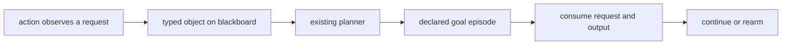

# GitHub Issue Draft: Evolving Mode Essentials

> **Status: canonical long-form proposal, v4.** The shorter body posted as
> issue #1756 is the maintainer-facing summary. v4 describes the phase-1
> contract as implemented and test-pinned on the
> `evolving-mode-episode-ladder` branch: derived episode rules under a
> single `withEvolving` declaration, the founding episode and committed
> objective, occurrence designation through `evolve`, routing by planning,
> and framework-dispatched child execution as the default rung, over
> `createChildProcess` with declared child options. The declared `EpisodePolicy` dialect described
> by earlier versions was implemented, fully test-pinned, and then deleted
> once derivation subsumed it; its shape survives in git history.
> Sub-issues 2-8 predate the derived shape and are queued for a
> follow-up editing pass.

Draft issue text for the post-1.0.0 Evolving Mode discussion.

Discussion context: https://github.com/embabel/embabel-agent/discussions/1725

### Title

Evolving Mode

### Body

Embabel Agent already replans as actions add typed objects to the blackboard, and existing goals can become achievable during a running process. What's missing is an explicit goal lifecycle for work that should complete without ending the process and become eligible again for a later occurrence.

I've coined 2 terms:

- **Deterministic Evolving**: a runtime fact drives a known declared goal episode to completion without ending the process, and a later fact can run it again. The connection is typed and known ahead of time.
- **Open Evolving**: not every fact-to-goal connection can be wired ahead of time. An `ObjectiveAuthor` can propose a validated policy revision when the predefined policy cannot handle what the process discovers.

My read on Evolving Mode is that declared agent metadata should remain immutable, existing planners should be reused, and no new `PlannerType` is needed.

The core loop is:



### Motivation

The README describes Evolving Mode as working with multiple goals in one process and modifying a running process to add further goals and agents. Its example says an action can realize that additional goals have become important.

Current Embabel already covers more of that sentence than I initially understood. An action can add an object to the blackboard, a declared goal requiring that object becomes plannable, and GOAP or HYBRID can pursue it at the next planning tick. The missing deterministic infrastructure is the lifecycle around that goal completion:

- completing selected side work should not complete the process;
- its triggering request and satisfying output must not keep the goal satisfied forever;
- a later request should be able to run the same episode again.

The [baseline tests](https://github.com/Stuckya/embabel-agent/blob/goal-episode-baseline-tests/embabel-agent-api/src/test/kotlin/com/embabel/plan/GoalEpisodeBaselineTest.kt) demonstrate both the existing behavior and these gaps under GOAP and HYBRID.

The two halves of the README sentence map to Open Evolving's two triggers, the two kinds of lack. "Add further goals" is the blocked episode: a missing fact, answered by authoring an episode to produce it. "And agents" is the unroutable evolve: a missing capability, answered by adding a handler. Both lacks are machine-detected, named, and verifiable.

The more emergent reading of the README arrives later through Open Evolving: validated objective-policy revision when no predefined connection covers a discovered need. The "and agents" half is process-local scope expansion using already-declared `@Agent` or `@EmbabelComponent` instances.

A `@Condition` remains the right model for current truth. Evolving episodes are for selected facts that represent a unit of follow-up work to handle once. The framework should own that completion and rearm bookkeeping rather than require lifecycle-only actions, manual blackboard hiding, and value tuning in each consumer application.

In the terms of Russell and Norvig's *Artificial Intelligence: A Modern Approach* (AIMA, 3rd edition, §11.3.3), this is the online replanning agent. Per-tick replanning already gives Embabel action and plan monitoring; goal monitoring — "is there a better set of goals" before each action — is what Evolving Mode adds, and episodes are the lifecycle that keeps it meaningful by letting a handled goal leave the candidate set. The section's opening example — a spot-welding robot that handles a fallen door mid-cycle and then resumes its standing work — is this epic's motivating example in textbook form. The same chapters name the field's remedy for hand-tuned search guidance: strong domain-independent heuristics derived automatically from action structure (§10.2.3). Heuristics estimate cost within plan search; preferences between competing goals remain utility values. Deriving search guidance from the condition graph is a future issue beyond this epic. Two further chapters ground the runtime contract. Serial episode admission implements the serializable-subgoals condition (§10.5, the Remote Agent trick): noninterleaved handling is complete exactly when subgoals cannot interfere, and episode validation manufactures that non-interference. And the blocked-episode story is §11.3.3's plan repair: when an episode is blocked on a missing input, deterministic mode waits for the fact, and Open Evolving can author a bounded episode to produce it.

### Proposed Work Streams

As discussed in #1725, I've split this into work streams. They do not have to be strictly sequential, but the first is the smallest working slice and should stand on its own.

1. Nonterminal repeatable episodes from internally observed facts
2. External fact ingress and automatic wake
3. Observability support
4. Cooperative interruption of the running action
5. Open Evolving: `ObjectiveAuthor` re-authoring at a planning tick
6. Process-local scope expansion
7. Recurring goal episodes for native pure-GOAP standing work. AIMA calls these maintenance goals. Event-driven waiting ships with ingress (2)
8. Example application

### Motivating Example

A concrete event-driven process might have a long-running objective such as:

```text
As a robot, collect samples in Zone A until 500 samples are stored.
```

The process runs over scoped capability or agent instances:

- sample collection
- robot navigation
- sample storage
- sensor calibration

The traditional Embabel pieces:

- declared actions handle collection, navigation, and storage
- declared goals are satisfied by normal action outputs such as `SamplesStored`
- conditions and values still control availability and action selection

For example, `sampleTrayFull` is ongoing state. It stays true while the robot's sample tray is full and becomes false after the samples are stored. It should be modeled with `@Condition` and action preconditions, not as a runtime goal:

```java
@Condition(name = "sampleTrayFull")
boolean sampleTrayFull(SampleTraySnapshot tray) {
    return tray.count() >= tray.capacity();
}

@Action(pre = "sampleTrayFull")
AtStorage navigateToStorage(CurrentLocation current, StorageLocation storage) {
    // navigate to the storage area
}
```

In this example, `sampleTrayFull` only gates whether storage/navigation actions are available. Evolving Mode is not involved merely because the tray is full.

Deterministic Evolving takes over when a selected typed fact represents known follow-up work this run should handle once:

- `SensorCalibrationRequested`

Other progress facts can remain ordinary blackboard facts that terminal goals, conditions, or actions read:

- `SampleCollected`
- `SamplesStored`

The entire consumer API is one declaration and one entry point. The mode is declared once on the process; every episode rule is derived from the goal graph:

```java
var options = ProcessOptions.DEFAULT
    .withPlannerType(PlannerType.HYBRID)
    // The committed objective: the founding episode completes the
    // process when this goal completes, and no other completion ends it.
    // Omitting the objective makes the process intentionally infinite.
    .withEvolving(GoalTarget.output(SamplesStored.class));

var agent = AgentScopeBuilder.fromInstances(
        new SampleCollection(),
        new Navigation(),
        new SampleStorage(),
        new Calibration())
    .createAgentScope()
    .createAgent(
        "sample-collection",
        "example",
        "Long-running sample collection");

var process = agentPlatform.createAgentProcessFrom(
    agent,
    options,
    new CollectSamples("Zone A", 500));

// An action that observes a calibration request publishes it as an
// occurrence. Designation rides the instance, at the publication site:
process.evolve(new SensorCalibrationRequested("sensor-7"));

agentPlatform.start(process);
```

Everything in this sketch except `withEvolving` and `evolve` exists on main today. There is no per-goal policy: which goals are episodic, which types drive them, and what completion consumes are all derived from the declared goal graph at process creation. The governing rule — the declaration razor — is: delete declarations that restate the goal graph; keep declarations that add facts the graph lacks. Exactly two survive it. The mode itself, because episodicity is a task-environment classification (AIMA ch 2) the graph cannot express. And the objective, because a terminal goal and an episodic goal are provably indistinguishable in the graph — both are goals awaiting an outside fact.

During phase 1, an action that observes the calibration request publishes it through `evolve` — the only occurrence ingress. A plain `ActionContext.addObject` fact is standing state, never an occurrence, however its type reads. `ReplanRequestedException.blackboardUpdater` remains the yield-and-replan path from inside execution. External `process.ingress().publish(...)` — exogenous events, in AIMA §11.3.3's sense — is phase 2.

`ProcessOptions.withEvolving(...)` is the Phase 1 core. Existing invocation paths already accept `ProcessOptions`, so evolving processes need no new invocation type. Without the declaration, `evolve` fails fast naming it: default mode is untouched by this epic.

Because the declaration lives in `ProcessOptions`, it composes with Autonomy/Open and every other path that creates a process with options. The selected or assembled agent remains responsible for scope. Derivation runs against that actual agent when the process is created; a goal whose graph cannot support episodes is excluded with a recorded reason, not rejected — the agent never asked for episodes on that goal — and the reason surfaces verbatim at any `evolve` that needed it.

Derivation does not teach the planner how to discover or pursue goals. The existing planner already does that. It identifies which goal completions are nonterminal episodes and owns their consume/rearm lifecycle. Selection remains with existing conditions and plan values.

### Phase 1 API Surface

The complete deterministic phase-1 surface as shipped, gathered in one place.

```java
// The whole mode declaration: presence declares the environment evolving,
// the optional objective is the mission's committed end, and execution
// chooses the episode rung - framework-dispatched child by default
enum EpisodeExecution { CHILD, IN_PROCESS }
record Evolving(GoalTarget objective, EpisodeExecution execution) {}

// The ProcessOptions withers
ProcessOptions withEvolving();                      // no objective: intentionally infinite; child execution
ProcessOptions withEvolving(GoalTarget objective);  // anchored completion; child execution
ProcessOptions withEvolving(Evolving evolving);     // full control, including the in-process opt-out

// Occurrence ingress, validated at the call
process.evolve(Object fact);   // throws for unroutable types, naming every exclusion and why

// Target references, canonicalized against the active scope at process creation
GoalTarget.output(Class<?> satisfiedByType)  // all scoped declared goals satisfied by that type
GoalTarget.named(String goalName)            // exactly one declared goal by stable identity

// Manual dispatch for explicit crews: options declared at the dispatch site
AgentPlatform.createChildProcess(agent, parent)           // inherits, minus the evolving declaration
AgentPlatform.createChildProcess(agent, parent, options)  // declared verbatim; evolving children compose
```

There is no rule type in the public surface. Rules are derived: at process creation, every declared goal whose graph supports episodes — an every-path off-chain default-binding input to arrive as the occurrence, a consumable satisfying output so the episode can rearm — gets a derived rule; every other goal is excluded with its reason recorded. The objective is always excluded: the mission is the tournament, never one of its games, so an occurrence evolved toward it fails fast rather than making the mission unfinishable.

Each arriving occurrence becomes a runtime `Episode`: it holds the request that began it, the consumables its chain has made, and its lifecycle state (`PENDING`, `ACTIVE`, `COMPLETED`). The definition: an episode is one occurrence of a request, planned to goal completion. Completion consumes the request and whatever the episode made. That is what makes the next occurrence independent. In AIMA chapter 2's terms the request is the episode's percept: its arrival begins the episode, its consumption ends it. The process itself is the outermost episode — the founding episode, active from construction, holding the founding percept (the initial observations), terminal from within and episodic from a parent's level. Founding-frame work executes inside it, so its evolves record it as their cause; an `evolve` from outside any action is uncaused, an external percept. The runtime objects are internal in phase 1; later phases surface them through events (3), a cancellation handle (4), and authoring (5). One supporting blackboard primitive ships: `Blackboard.reveal(Object)`, the identity-based inverse of `hide`, a default interface method.

Surface rules, gathered from the sections below:

- Designation rides the instance: `evolve` publishes an occurrence; plain `addObject` is standing state, whatever its type. `evolve` on a non-evolving process fails fast naming `withEvolving`.
- Nonterminal completion and consumption are one contract, never two switches.
- Completion is anchored: only the objective's completion completes the process. No objective means intentionally infinite — work runs, achievements are recorded, nothing is authorized to end the mission.
- Recognition point: `SimpleAgentProcess.handleProcessCompletion(...)`, shared by simple and concurrent processes.
- Completion emits `EpisodeCompletedEvent`, a `GoalAchievedEvent` subtype, after consumption and never with a process-finished event; the founding completion emits the terminal pair. `evolve` publishes through the process's object-event path, so listeners observe arrivals like any addition.
- A child never inherits the evolving declaration; a child becomes an evolving loop only by explicit dispatch-site declaration, so levels compose deliberately and the tower is unbounded.

Not phase 1: `ingress()` (phase 2, Sub-Issue 2), an `interruptsCurrentAction` episode field (phase 4 adds it), `withObjectiveAuthor(...)` (phase 5), `recurring(...)` (work stream 7), and `ctx.evolve()` on `ActionContext` — proposed, unbuilt, the oldest item on the ergonomics list.

### Runtime Semantics

The existing type, condition, binding, goal, and planner model remains authoritative. A request object can make one or more declared goals plannable today. Episode policy changes what happens when a selected candidate goal is satisfied; it does not maintain a second goal set or add a planner overlay for deterministic phase 1.

An episode is one bounded plan-execute-complete cycle. It is not an atomic block: per-tick replanning can interleave standing work between its steps when values favor it (baseline test 10). Three runtime mechanisms carry the contract.

**Serial admission.** Each arriving occurrence of a rule's request type becomes an `Episode`. At most one episode per rule is `ACTIVE`; later arrivals wait `PENDING`, hidden and queued FIFO, and are revealed and admitted when the active episode completes. A pending request never changes type-level conditions, because the active request of the same type stays visible. Occurrence pairing is therefore identity, not ordering: each chain binds exactly its own request, and completion consumes exactly that instance. Serial admission also cures a v1 pathology: a completing action that publishes the follow-up request now chains cleanly, one episode per occurrence, instead of livelocking. Admission is per rule, so episodes of different kinds run concurrently interleaved and never queue behind each other.

**Consumable attribution.** While a plan serving an episode's goal executes, new instances of its actions' declared consumable types are recorded onto that episode by identity as they appear. Ownership follows the plan being served, not chain membership: relevance is goal-relative (AIMA §10.2.2), and an action serving another business goal attributes nothing, however many chains it appears in. Per-tick value selection's opportunistic steps execute under the unsatisfiable pairing goal, where no served goal exists; membership remains the documented fallback there. The gate stays membership-based deliberately: plannability is potential, attribution is actuality. On completion the framework hides the request and the completed candidate's attributed consumables: exactly what this occurrence made, nothing made elsewhere. Nothing is deleted; the blackboard remains append-only. A stale intermediate of the episode's own making cannot shortcut the next occurrence's plan, while an instance made elsewhere is used, not consumed, and survives as a standing resource — AIMA §11.1's consumable versus reusable distinction, enforced per instance. Standing state the scope maintains for itself — an action whose effects satisfy its own input, or a multi-action cycle regenerable without a fresh occurrence, by the planner's matching rules — is never attributed and survives completion.

**Occurrence designation.** Admission has one source: the process's `evolve` entry point. Designation rides the instance at publication, where the knowledge lives — the observer that publishes a fact knows whether it is a request or standing state; the chain author declares nothing. No driver mapping exists anywhere, so a chain with several off-chain inputs needs no disambiguation: whatever arrives through evolve is the occurrence, and a plain fact of the same type is never admitted and survives untouched. Evolving a type no derived rule can route fails fast at the call site, naming the type, the evolvable set, and every excluded goal with its recorded reason — the exception content is Open Evolving's authoring input. Each evolved instance records the episode whose action published it, founding episode included, so lineage is captured at the boundary for every publisher: every episode answers why it exists. **Routing is planning.** A contested arrival — a type eligible for several derived rules — is owned by the rule whose goal the planner values highest, the same best-value decision default mode makes over shared input types. Ownership resolves at the next planning tick, not at the call: a mid-action evolve precedes its own action's remaining effects, so the arrival's world must materialize before it is judged. Arrival order stays the boundary fact; ownership, once resolved, is admission policy and is not renegotiated.

**Activation and the gate.** A derived rule becomes episodic at its first observed occurrence. Before that the goal is founding-frame: it plans, runs, and its achievement is recorded — and withdrawn from planning so a satisfied incident never outcompetes the mission — but nothing completes the process except the objective. After activation, the rule's exclusive chain actions are excluded from planning whenever it has no active episode, through the same exclusion mechanism the replan blacklist uses, so a plain fact can never drive an activated chain. An action serving a live episode is never gated by a dormant sibling sharing it: liveness wins. A later occurrence reopens a frame-achieved goal — the goal was achieved as state, and a fresh request makes it unachieved by definition.

**The founding episode and anchored completion.** The process is the outermost episode: active from construction, its percept the initial observations, terminal from within. Completion is anchored to the committed objective — the founding episode's goal — and to nothing else. An incidental achievement is recorded and the mission resumes: the spot-welding robot reattaches the door and resumes its work (§11.3.3, p. 422). Terminal evaluation precedes rearming: at an episode boundary, plannable founding-frame work runs before any pending occurrence is admitted, so the ending never competes on value with the queue. The guarantee is scoped honestly: pending occurrences cannot outbid the terminal plan, while standing HYBRID work competing on value is goal monitoring behaving as the book describes, and can defer the ending — test-pinned as a deliberate open choice, not an accident.

The lifecycle is per occurrence and the declared goal is reusable. Completing an episode never completes the process. Ordinary declared goals keep today's behavior and may complete the process. Episodes are independent, not idempotent: duplicate requests are distinct occurrences and each is handled, while standing state legitimately advances across episodes.

The contract has two rungs, following AIMA ch 2's observation that environments are episodic at higher levels than individual actions — and the higher rung is the **default execution strategy, performed by the framework**. Two of the book's own classifications validate the split. A child's snapshot world is static and fully observable in ch 2's taxonomy — nothing can change under the child but its own actions — which is exactly the environment class where classical full-path planning is sound: the rung split manufactures the world its planner assumes. And the children are multibody, not multiagent (§11.4, p. 425): "a multibody problem is still a 'standard' single-agent problem as long as the relevant sensor information collected by each body can be pooled … to form a common estimate of the world state" — merge-back is that pooling condition, which is the soundness argument for the whole child model. Under `EpisodeExecution.CHILD` (the default), dispatch is a selection outcome, not an admission side-effect: each tick the planner weighs the frame's best plan against every active episode, each valued by the full-path plan its child would run, and the winner executes — one execution per tick, so standing work and episodes interleave exactly as value dictates, on both rungs, with selection owned by the planner throughout. The framework projects the winning episode's derived chain into a child process it synthesizes, runs it, and merges the outcome home. The developer writes one ordinary agent and calls evolve; dispatch, isolation, and merge-back are invisible. The child boundary draws structurally what in-process mechanisms police — begin-episode is the child's birth, end-episode its completion, and the planner cannot wander out of an episode that is the whole world it lives in. Pairing rides the snapshot for free, because queued occurrences hidden in the parent stay hidden in the child. A stale satisfying output cannot vacuously complete a child, because execution history is process-scoped. An `evolve` from inside a child delegates up the tower to the nearest evolving ancestor, so self-chaining authors identically on both rungs. The merge-back contract was decided empirically: everything the chain wrote comes home, consumable-typed instances consumed at completion and undeclared standing writes surviving as they would in-process — the strict declared-outputs-only alternative was tried and rejected when it stranded the batch tally in dead children and made self-chaining spin unboundedly. That experiment also produced the brake: dispatches spend the parent's action budget, so an unbounded chain terminates exactly as an in-process spin would. A chain the parent can predict will stall is never a candidate at all - valuation uses the child's own full-path planner, so a blocked episode costs one plan check per tick, not a doomed process (the sphex-wasp hazard, p. 425 note 5). A failed child is contained, its occurrence unconsumed; the next tick's selection respawns a fresh child within the same run, bounded by the parent's action budget. Framework children inherit the parent's options - budget limits, identities, context - minus the evolving declaration, with the full-path planner forced; their counters are fresh against the parent's limits, each dispatch spends one parent action, and hierarchical draw-down is a named platform follow-on. Manual dispatch through `createChildProcess` with declared options remains available for explicit crews, and declared options make the tower unbounded: an evolving child inside an evolving parent, composed deliberately and never by inheritance. `EpisodeExecution.IN_PROCESS` is the declared opt-out — hot loops sharing live standing state, at the price of the mechanisms below policing the walk. Both rungs carry one contract, and the derivation never knows where a chain runs. Parallel same-rule episodes belong at the child rung, where a bounded admission width — how many may run at once — encodes the capacity of what the chains borrow (§11.1's `Inspectors(2)` aggregation). Width defaults to one and its generalization ships with phase 2's async dispatch.

Nonterminal completion and consumption are one contract. They should not be separate switches: a nonterminal goal that leaves its request or satisfying output visible remains satisfied, so its empty plan can immediately compete again.

`GoalTarget.output(T)` may identify several declared candidate goals satisfied by `T`; normal conditions, heuristics, and plan values choose among them. The first completion finishes the episode. A target with no scoped producer fails fast. The exact target representation remains an API-design question.

The phase-1 implementation should not introduce keyed goal-instance satisfaction. Domains needing key-specific behavior should use existing types, conditions, bindings, and action inputs. Episode rearm rides the existing `canRerun` contract: the framework does not reset execution state, and an episode whose completing action declares `canRerun = false` is deliberately one-shot.

### Blackboard Model

In my own project, I've treated the blackboard as process-local working memory for an `AgentProcess`. Not a mutable world-state database. Not a pub/sub bus. Not an external-event ingestion mechanism. (To be transparent: docs describe it as "the shared memory system that maintains state throughout the agent process execution" and show direct `blackboard.add(...)` in examples. The framing here is the position this proposal takes on what external ingress must preserve, not a quote of existing documentation.)

From our Motivating Example, Embabel should probably not own domain state like tray contents, inventory, or sensor snapshots. The consumer application owns those modules. Embabel consumes `@Condition`, action inputs, scoped capabilities, selected request facts, and episode/objective policy. A `@Condition` can read current truth from those modules directly. Current state does not need to be republished to the blackboard as facts, and high-frequency or reversible state stays outside Evolving Mode entirely.

Internally, actions already use `ActionContext` and ordinary Embabel execution to add objects. For external callers, selected facts should enter through a sanctioned process-local ingress API that queues publication for a planning tick rather than exposing unsynchronized blackboard mutation.

### Relationship To `@Action(trigger = ...)`

I'd keep `@Action(trigger = X.class)` as an action-level reactive feature. It is useful when `X` is the latest result and the triggered action can run directly. It does not queue or identify occurrences, and it provides no consume/rearm lifecycle; those remain ordinary action and blackboard behavior.

I don't think it should be the Evolving Mode mechanism. `trigger` is based on `lastResult`, so it is fragile as a step inside a forward GOAP plan:

- a prefix action can overwrite `lastResult` before the triggered action runs.
- a planner that needs a complete static path cannot route through a trigger action whose event is not already the latest result.

The boundary could be:

- use `@Action(trigger = X.class)` for simple reactive handlers where no planner-visible lifecycle is needed.
- use episode lifecycle when a typed request should drive a declared goal to completion, consume its request/output, and allow the process to continue.

An `@OccurrenceFact`-style marker was considered and rejected. It would put Embabel lifecycle semantics on domain types and make a goal's completion behavior depend on how the goal was reached. Episode policy keeps that behavior explicit on the process. In short: `trigger` covers latest-result, single-action reactions; episodes cover planned handling with once-per-occurrence lifecycle and nonterminal completion.

### Relationship To `ReplanRequestedException`

Evolving Mode should compose with the existing `ReplanRequestedException`, not introduce another action-initiated replanning mechanism. If an action or tool observes a request while abandoning its current path, it can throw `ReplanRequestedException` with a `BlackboardUpdater` that adds the object. The process applies the update, remains `RUNNING`, and the existing planner sees the newly plannable goal at the next planning tick.

`ReplanRequestedException` does not provide episode lifecycle. It provides the existing "yield, update the blackboard, and replan" path from inside action execution.

External ingress is different. A publisher runs outside the action execution stack and cannot throw an exception into the process. Phase 2 therefore still needs an explicit wake mechanism, but both paths converge on the same planning-tick processing and existing planner.

### Cooperative Interruption

Making a new response goal plannable changes what the planner may select at the next planning tick. It does not interrupt an action that is already executing. Consumers with long or blocking actions should not have to split them into planning-tick-sized steps to stay responsive to urgent facts.

For urgent external facts, a later phase may add `.terminateCurrentAction()`: request graceful interruption through the existing `AgentProcess.terminateAction` machinery, then let normal planning choose the response after the action yields. No threads are killed, and an action that cannot observe cancellation runs to completion.

### Episode Matching and Rearm Semantics

The phase-1 contract is deliberately concrete. When a derived rule's goal completes with an active episode, the framework consumes the episode's request by identity and its attributed consumables: the satisfying output and any intermediates this occurrence actually made. A later occurrence replans the same episode from scratch — the episode's own stale intermediate cannot shortcut it. Consumption follows attribution, not type: what this occurrence manufactured is consumed, while everything else survives — other off-chain inputs, self-maintained facts, and same-type instances made elsewhere. A foreign chain product the planner routes through is used, not consumed, and later occurrences may legitimately reuse it. That is AIMA's consumable versus reusable resource distinction (§11.1), enforced per instance rather than approximated per type. Overlapping occurrences are handled by serial admission: FIFO in arrival order, one active at a time, pending arrivals hidden until admitted. A completing action that publishes the follow-up occurrence through evolve chains cleanly — the follow-up is queued at arrival, admitted after its request is consumed, and handled exactly once. The known cost of serial admission is head-of-line blocking within one rule (AIMA §11.1.2 p. 405: a nonoverlapping sequence is sound "provided that each action is feasible by itself"): a blocked active episode stalls its own queue, never another rule's. Phase 2's `BLOCKED` state and publication-time wake address it; phase 3 surfaces queue depth behind a stall. Designation binds as well as consumes, through three visibility windows over existing hide and reveal — standard ground-action semantics per occurrence (AIMA §10.1). The request window: while a chain action executes, the episode's request is the only visible instance of its own class, so binding by type resolves the occurrence the episode holds. The outcome window: standing instances of the rule's consumable types are shadowed at admission and revealed at completion, so a founding-frame product cannot keep the goal satisfied and complete the episode vacuously — shadowed, never consumed. Attribution has one cross-goal consequence, pinned: reader-built goals include their action's inputs in their preconditions, so consuming an episode's attributed input can retro-unsatisfy an unrelated goal that binds the same input type. The planner replans and reruns the producer to restore the fact. Bounded rework, correct attribution: outputs made outside the episode survive throughout.

Contested arrival types are legal and routed by planning, as Runtime Semantics describes; a goal underivable for episodes is excluded with its reason, never silently, and never rejected — exclusion is the derived dialect's fail-fast, relocated from construction to the boundary that needed the goal. Rules are per goal by construction, so no goal belongs to two rules. `GoalTarget.output(T)` as the objective may identify several candidate goals; the first completion completes the process, and a named objective must identify exactly one.

Chain membership is resolved statically at process creation — by walking the same condition graph the planner searches, so membership follows the planner's own assignability rules — and consumption is applied through `Blackboard.hide` at completion. The analysis computes the two bounds of angelic semantics (AIMA §11.2.3): the consumed request validates against the pessimistic description (required on every completion path), while the optimistic one (produced on any path) bounds which types attribution may record. Per-occurrence tracking is framework-internal — the runtime `Episode` carries it — and there is no consumer-facing activation API. Hiding is identity-based, honoring the hide contract: consuming an occurrence hides exactly that object, and a distinct but equal occurrence remains a live request. Domain records need no occurrence ids for lifecycle purposes. This is a fix, not a redesign: `Blackboard.hide` documents "hide this object", but the implementation hid by equality — a hash-set accident that coalesced distinct occurrences and permanently blocked an episode whose equal output had already been consumed. Phase 1 corrects `InMemoryBlackboard` to match its documented contract, and the full module suite passes unchanged. Reader-built goals also include `hasRun` of their achieving action, so a seeded or stale output cannot complete an episode without real work — the opposite of AIMA's serendipity, and test-pinned. The observable contract is consume once, do not complete the process, and allow a later occurrence to run again.

### Completion And Waiting

Completion in an evolving process is anchored to the committed objective: the condition-gated mission goal ends the sample-collection process at 500 stored samples because it is declared as the objective, not because it happened to be satisfiable first. Incidental achievements are recorded and the mission resumes. Without an objective the process is intentionally infinite — the standing-service shape Open Evolving implies — and its ending belongs to its caller: cancellation, or a parent consuming it as a child episode. Default-mode processes are untouched: any goal completes them, as ever.

Waiting itself already exists. An action can call the existing `waitFor(awaitable)`: it declares the awaited type as its return type so the planner can route through it, the process parks `WAITING` with the awaitable on the blackboard, and `Awaitable.onResponse` plus `run()` resumes it. The baseline tests show both halves: a `STUCK` GOAP process resumes manually after `addObject` and `run()`, and a `waitFor` action parks `WAITING` instead of `STUCK` and resumes straight into the goal. What is missing is only the wake — the resume is driver-owned today. The platform's existing `StuckHandler` covers the other half of recovery: an agent-supplied hook that fires at the moment a process becomes stuck and may repair state and replan. It is stuck-time and pull-based, so it cannot wake a long-parked process when a fact arrives later; that publication-time half is what ships with external ingress (phase 2). Waiting permits externally driven episodes; it does not make pure GOAP execute standing work on its own (that is work stream 7).

### Objective Author Relationship

The two shapes from the intro map to two process options. Deterministic Evolving is `ProcessOptions.withEvolving(...)`. Open Evolving is a later `ProcessOptions.withObjectiveAuthor(...)`: Open-style deliberation authors an `ObjectivePolicy`, and an optional `EvolvingInvocation` can provide fluent sugar over the same option. Open Evolving covers what no predefined rule can. An unknown blocker. No viable plan. Unresolved runtime facts at a planning tick. It should not require predeclared per-type hooks like `.onUnhandledFact(X.class)`. That would just be Deterministic Evolving with extra steps.

This should follow Open mode's discipline: LLM-backed authoring can rank or select among declared scoped goals and propose objective-specific policy, but execution only uses validated scope objects.

An `ObjectiveAuthor` should author typed objectives or objective policies. Those policies may identify episode goals, completion rules, and runtime goal or scope revisions. The framework validates the authored policy against the active scope before installation: at launch for initial policy and at a planning tick for Open Evolving revisions.

Open mode and Open Evolving use the same kind of authoring judgment and the same declared-goal boundary. Open mode selects before running a process; Open Evolving revises policy at a planning tick in the same running process.

> [!NOTE]
> I think Open-style authoring should stay outside the hot loop. Runtime actions emit typed facts rather than inventing new goals.

### Policy Sources

Policy reaches a process from two places:

- **Base policy**: installed by the consumer application through `ProcessOptions`, such as recovery and episode lifecycle rules.
- **Objective policy**: authored for a particular run, such as objective-specific episodes, completion rules, utility defaults, and initial facts.

The `ObjectiveAuthor` should not need to remember universal safety and recovery rules. A launch-time validation step should merge base policy and objective policy, canonicalize all goal targets against scope, and reject the merged policy if any required handler has no scoped producing capability.

### Open questions

Maintainer input would be helpful on these decisions. Three earlier open questions are now decided and test-pinned: episodic is ambient (`withEvolving` derives every rule; the stance shipped), the completion model is the committed objective (the founding episode is terminal; incidental achievements resume), and no rule spellings remain because no rule surface remains — the razor deleted it.

- **Where does evolve live, and what does its rejection throw?** `process.evolve` is the shipped surface; `ctx.evolve()` on `ActionContext` and `evolve` on the `AgentProcess` interface are the proposed homes, and every test currently casting `context.agentProcess` is the evidence they are overdue. The unroutable rejection is `IllegalArgumentException` today, carrying the exclusion reasons; a distinct type would let publishers and phase-5 machinery catch it specifically.
- **Should a plannable objective structurally preempt standing frame work?** Deferred admission guarantees the queue never outbids the terminal plan, but standing HYBRID work competing on value is goal monitoring (§11.3.3) and can defer the ending until the budget intervenes — test-pinned as a deliberate choice. Forcing the objective would kill legitimate pre-shutdown opportunism; not forcing it means a mission can weld forever. This is the sharpest genuinely-open semantic question.
- **Re-derivation on a live process.** Derivation runs once at construction, and the runtime keys activation, admission, and queues by rule instance. Open Evolving's "add further goals and agents" needs scope mutation plus re-derivation with rule identity preserved across derivations — likely keyed by goal name. Nothing forecloses it; nobody has built it.
- **Parallel actions inside one evolving process.** The episode machinery is single-threaded by construction: execution context lives in process fields, and grounding windows mutate shared visibility. Child execution dissolves this — parallel episodes are parallel processes — so the in-process variant is deliberately unsupported rather than half-supported. Whether it is ever worth building is a real question; the honest alternative is instance-scoped binding views, the deeper platform primitive the two grounding windows approximate.
- **How do `withObjectiveAuthor(...)` and the derived scope combine?** Authoring under derivation is simpler than under declared policy — an authored goal enters scope and re-derivation does the rest — which strengthens phase 5 but leaves its conflict-handling questions open.

### Additional Context

> [!NOTE]
> Disclosure: This section was fully generated by Claude while I was vetting this spec. I found it helpful in staying consistent during research, so I left it and collapsed it by default.

<details>
<summary><strong>Vocabulary Key</strong> — the terms this issue leans on, defined once</summary>

- **Declared capability** - immutable `@Agent` and `@EmbabelComponent` actions, conditions, and goals.
- **Consumer application** - the application using Embabel, configuring invocation, providing scoped capabilities, owning domain state modules, and publishing selected external facts.
- **Request fact** - typed domain object on the blackboard that represents one occurrence of follow-up work. Not a new public `Fact` API.
- **Episode / goal episode** - one occurrence of a request, planned to goal completion. Completion consumes the request and whatever the episode made, which is what makes the next occurrence independent (AIMA ch 2: "the next episode does not depend on the actions taken in previous episodes"). At runtime an episode is a framework-internal object holding its request, its attributed consumables, and its state (`PENDING`, `ACTIVE`, `COMPLETED`). In AIMA terms it is one pass of the plan-execute-replan loop (§11.3.3), and its request is its percept (ch 2). Not an atomic block: per-tick replanning can interleave standing work between its steps (baseline test 10). Independent, not idempotent: duplicate requests are distinct occurrences. Work stream 7 explores recurring episodes — no request — for pure-GOAP standing work.
- **Derived rule** - the framework-internal artifact of derivation: for each declared goal whose graph supports episodes, the eligible arrival types, chain membership, and consumable types, computed at process creation by a §10.2.2 regression over the goal graph. Never declared; each admitted occurrence is an episode of it.
- **Declaration razor** - the deletion test that produced this surface: delete declarations that restate the goal graph; keep declarations that add facts the graph lacks. Two survive: the evolving mode itself and the committed objective.
- **Committed objective** - the founding episode's goal, declared in `withEvolving(objective)`. Only its completion completes the process; the mission "needs to know what it's trying to do" (§11.3.3, p. 422). No objective means intentionally infinite.
- **Founding episode / founding percept** - the process as the outermost episode: active from construction, its percept the initial observations, terminal from within and episodic from a parent's level (ch 2, p. 45: the tournament is not one of its games). Founding-frame work executes inside it and roots lineage.
- **Exclusion** - derivation's fail-fast: a goal whose graph cannot support episodes (or which is the objective) is excluded with a recorded reason that surfaces verbatim at any evolve needing it. Exclusion is not rejection; the agent still runs.
- **Child execution** - the default rung: the framework synthesizes a child process from the derived chain, runs the episode there, and merges the outcome home. The child boundary draws structurally what in-process mechanisms police. Manual dispatch through `createChildProcess` remains for explicit crews and for the tower, since framework children are default-mode and an evolving child requires declared options. `EpisodeExecution.IN_PROCESS` is the declared opt-out.
- **Consumable** - an instance a chain action made for the active episode, recorded by identity as it appears (AIMA §11.1's consumable resource). Completion consumes the completed candidate's consumables and nothing made elsewhere; foreign same-type instances are used, not consumed.
- **Evolve / occurrence designation** - publishing a fact as an occurrence (`process.evolve`, proposed `ctx.evolve()`). Designation rides the instance: evolved facts are admitted to drive episodes, plain facts are standing state, and the same type can be either by call site. Unroutable evolves fail fast; with an author they become the capability trigger.
- **Lineage** - each evolved occurrence records the episode whose chain published it (`causedBy`) and the publishing action's name (`publishedBy`), so every episode answers why it exists: a causing episode and action, an ingress source, or an author.
- **Serial admission** - one active episode per rule; later arrivals wait pending, hidden and queued FIFO, admitted on completion. Pairing by identity. Known cost: head-of-line blocking within a rule, addressed by phase 2's `BLOCKED` state.
- **Activation and gate** - a derived rule becomes episodic at its first observed occurrence; before that its goal is founding-frame and runs ungated. Once activated, its exclusive chain actions are plannable only while it has an active episode — and an action serving a live episode is never gated by a dormant sibling. Everything in evolving mode happens inside an episode: an owning evolved episode, or the founding one.
- **Runtime goal** - reserved here for a process-local objective proposed later by Open Evolving or scope expansion. Deterministic phase 1 reuses declared goals rather than adding a second goal set.
- **Deterministic Evolving** - predeclared episode lifecycle for known request types and known declared goals.
- **Open Evolving** - an `ObjectiveAuthor` authors or revises the objective policy when predefined episode policy and scope cannot handle the situation. It proposes goal references as typed data, never executable code. Proposed goals use the same scope validation and may opt into the same nonterminal lifecycle.
- **Planning tick** - the boundary where the process plans: after an action completes, when a wake re-drives a parked process, or when the consumer's driver ticks. Ingress drains, newly visible requests may make declared goals plannable, and `@Condition` state is re-read. A tick replans from current state; the first implementation has no plan cache. Per-tick replanning is AIMA's online replanning and subsumes its action and plan monitoring.
- **Fact occurrence** - the exact request object added to the blackboard. Phase 1 consumes that occurrence through existing `Blackboard.hide` behavior, which is identity-based: the exact consumed instance disappears and equal payloads remain distinct occurrences.
- **Off-chain input** - an input the planner cannot manufacture from any scoped action's effects: seeded at process creation, observed mid-run through `ActionContext`, or arriving through phase-2 ingress. The planner cannot manufacture it, and episode completion never consumes it — except the configured request occurrence, which is itself off-chain. Unrelated to `@State`, which groups action availability.
- **Application-owned state module** - consumer-owned state such as sensor snapshots, tray contents, inventory, or connection/session state. Embabel should consume this through action inputs, `@Condition`, scoped capabilities, and selected occurrence facts, not own the whole state model.

</details>

<details>
<summary><strong>Decision Guide</strong> — which primitive fits which situation</summary>

| Situation | Prefer | Example |
| --- | --- | --- |
| The planner needs current truth. | `@Condition` or action input | `sampleTrayFull`, `doorOpen`, `hazardVisible` |
| An action should only run while current truth holds. | `@Condition` + `@Action(pre = ...)` | `navigateToStorage` only when `sampleTrayFull` |
| A fact reveals known follow-up work that should complete without ending the process. | Deterministic Evolving episode | `SensorCalibrationRequested -> SensorCalibrationCompleted` |
| An episode's steps depend on current truth. | Episode lifecycle + `@Condition` | Calibration actions gated by `atMaintenanceBay` |
| Known follow-up work is urgent and the current action should yield. | Episode lifecycle + cooperative `terminateAction` integration | An urgent recovery request cancelling an in-flight navigation action |
| A user asks for a broad objective before the process starts. | `ObjectiveAuthor` / `ObjectivePolicy` supplies the launch-time objective policy | "Collect samples in Zone A until 500 are stored, and run a sensor calibration check every hour" |
| The run discovers an unknown blocker or has no viable plan. | Open Evolving: `ObjectiveAuthor` re-authoring at a validated planning tick | `ZoneAccessBlocked(missingRequirement = Permit("P-42"))` -> propose runtime goal `PermitObtained` with a typed target |
| A reaction should fire off the latest result, no lifecycle needed. | `@Action(trigger = X.class)` | A notification action firing when `X` was just produced |
| The process must wait for a solicited external response. | Existing `waitFor` / `Awaitable` | An action promising `SensorCalibrationRequested` parks `WAITING` until the response arrives |
| The process should try to repair itself the moment it becomes stuck. | Existing `StuckHandler` on the agent | A handler seeding a missing fact and replanning |
| Work needs explicit phases scoping which actions are available. | `@State`; composes with episodes | Calibration actions available, storage actions not, while calibration is in flight |
| The only reason is "an event happened." | Usually not enough for Evolving | Project current truth into application state, then expose it through `@Condition` or action inputs |

</details>

### Validation Rules

- Episode targets MUST resolve only to canonical declared goals from the active scope. `GoalTarget.named(...)` resolves one stable goal identity. `GoalTarget.output(...)` resolves the non-empty set of scoped declared goals satisfied by that output type.
- A target with no producing scoped goal candidate MUST be rejected fast.
- A target with a scoped producer but currently missing facts or preconditions MUST remain a normal planner concern rather than being rejected as invalid configuration.
- Multiple output-type matches are alternative candidate goals for one episode. Existing conditions, heuristics, and ordinary planner selection narrow them; the first candidate completion completes the episode.
- Contested arrival types — eligible for several derived rules — MUST be legal and routed by the planner's best-value decision at the arrival's first settled tick, matching what default mode already does over shared input types. Ownership, once resolved, MUST NOT be renegotiated.
- The committed objective MUST be excluded from derivation, and an occurrence evolved toward it MUST fail fast naming the exclusion: an episodic objective would consume-and-rearm forever and the mission could never end.
- `evolve` on a process without the evolving declaration MUST fail fast naming `withEvolving`.
- In an evolving process, only the objective's completion MAY complete the process; incidental founding-frame achievements MUST be recorded, withdrawn from planning, and resumed past. A later occurrence toward a recorded goal MUST reopen it.
- Forged lookalike goals MUST NOT be able to smuggle different value, preconditions, or metadata through the episode or objective-policy APIs.
- Making ordinary work yield at planning ticks SHOULD be modeled with existing planning availability primitives: consumer-authored `@Condition` methods and `@Action(pre = ...)` preconditions make ordinary work unavailable while a domain condition holds. Goal and action values remain ordinary planner inputs, not an Evolving-specific priority or lane mechanism. Availability governs what is selected at the next planning tick. Interrupting an action that is already executing is the cooperative-interruption concern (`terminateCurrentAction()`), never a priority mechanism.
- `terminateCurrentAction()` MUST be cooperative only: it requests cancellation through the action-scoped token, never kills threads, never bypasses planning, and non-cooperative actions run to completion.
- Authored policies MUST reference declared goals with typed targets. Authoring MUST NOT introduce executable code, and per-instance declared goals (one goal per concrete target) SHOULD NOT be required where a generic goal plus typed target works.
- Memoryless ongoing state SHOULD remain in `@Condition` or action inputs. It is not an episode merely because it changes while the process runs.
- Episode candidates MUST be declared goal producers in the active scope, for example by producing the goal's satisfied-by type and using `@AchievesGoal` where appropriate. A candidate's satisfying output MUST be a per-occurrence product, never standing state the goal action maintains for itself: such an output would survive consumption and keep the goal satisfied forever.
- Episode completion MUST consume the active episode's request by identity and its attributed consumables — satisfying output and intermediates this occurrence made — before the process returns to ordinary selection. Self-maintained facts, other off-chain inputs, and same-type instances made elsewhere MUST survive. A goal completing with no active episode is founding-frame work, never an episode.
- Occurrence admission MUST be serial per rule: one active episode, later arrivals hidden and queued FIFO, the next admitted on completion. A pending request MUST NOT be visible to planning or binding while queued.
- An activated rule's exclusive chain actions MUST be excluded from planning while it has no active episode, so a plain fact can never drive an activated chain — while an action serving a live episode MUST never be gated by a dormant sibling, and a never-activated goal's chain runs ungated as founding-frame work.
- A derived rule's eligible arrival types MUST be the default-binding off-chain inputs required on every completion path — inputs the planner cannot manufacture. This guards attribution: a goal reachable without the occurrence could complete and consume an occurrence whose work never ran.
- Rules are derived per goal, so no goal belongs to two rules by construction. A goal sharing its name with any other scoped goal MUST be excluded, since completion recognition matches by name, and a named objective MUST identify exactly one goal.
- Normal action completion reaches the next planning tick through ordinary execution; action/tool-initiated early replanning reuses `ReplanRequestedException`; selected external facts use ingress and wake from phase 2. Declared actions from the scoped capabilities remain the only executable steps.

### Non-Goals

- Do not introduce a new `PlannerType`.
- Do not require a new invocation type for phase 1. Episode lifecycle should compose through existing `ProcessOptions` and invocation paths.
- Do not introduce an incremental planner or planning cache as part of Evolving Mode. Existing planners may plan again from current state when facts, policy, or scope change.
- Do not repeatedly invoke Open/Supervisor mode as the event loop.
- Do not include `terminal()` or `expires(...)` episode options in phase 1. Ordinary declared terminal goals retain existing completion behavior. Source-disappearance handling is deferred.
- Do not mutate user-declared `@Agent` or `@EmbabelComponent` metadata.
- Do not add agents/actions/capabilities to an already-running process in the first implementation pass. This epic proves goal-episode lifecycle first and treats process-local scope expansion as a later phase (Sub-Issue 6).
- Do not solve pub/sub fan-out in this issue.
- Do not require fact derivation to land before episode lifecycle. Deriving request facts from blackboard state is a possible later layer with its own ordering, provenance, and retraction contracts.
- Do not generate executable code at runtime. `ObjectiveAuthor` proposes references to declared goals with typed targets. Execution only ever runs validated scope objects.
- Do not add per-type hooks for the open path (no `.onUnhandledFact(...)`). Known request types belong in deterministic episode policy. Open Evolving is the generic re-authoring mechanism.
- The evolving declaration is process-scoped: a child never inherits it, becomes an evolving loop only by explicit dispatch-site declaration, and hiding travels with spawned blackboards.
- Do not provide persistence or rehydration in this epic: an evolving process is JVM-resident and single-instance. Phase-1 request/output hiding relies on in-JVM object identity and does not survive serialization. A durable, restartable long-lived-process story is separate future work.

## Sub-Issue 1

### Title

Evolving Mode phase 1: nonterminal repeatable goal episodes

### Body

Add explicit lifecycle for declared goals that represent repeatable, nonterminal episodes. **Status: implemented and test-pinned** on `evolving-mode-episode-ladder` (56 episode tests across eight suites; full module green). The text below describes the shipped contract.

This phase requires no external ingress and no new goal-discovery mechanism. An action that observes a request publishes it through `evolve`; the existing planner sees the matching declared goal at the next tick. `ReplanRequestedException.blackboardUpdater` remains the yield-and-replan path from inside execution.

Occurrence requests are observations, not outputs declared as producible steps in a GOAP path. If a planner action declares `SensorCalibrationRequested` as an output, A* correctly treats the request as something it can manufacture on demand. The baseline contrast test documents that difference; derivation enforces it, since only off-chain inputs are eligible arrival types.

Phase 1 ships six lifecycle guarantees:

1. satisfying an episodic goal never completes the process; only the committed objective does;
2. completion consumes the active episode's request by identity and its attributed consumables — the satisfying output and intermediates this occurrence made — through `Blackboard.hide`;
3. a later occurrence runs the same declared goal episode again, admitted serially in arrival order;
4. an activated rule's exclusive chain actions are plannable only while an episode is active, an action serving a live episode is never gated by a dormant sibling, and a never-activated goal runs ungated as founding-frame work;
5. designation rides the instance: `evolve` publishes occurrences, plain facts are standing state, and contested arrivals are routed by the planner against the settled world;
6. the process itself is the founding episode: terminal from within, episodic from a parent's level, with lineage rooted at its founding percept.

Default-mode processes are untouched. GOAP, Utility, and Hybrid retain their existing planning and selection behavior.

The shipped surface is one declaration and one entry point; there is no rule type, because rules are derived:

```java
ProcessOptions.DEFAULT.withEvolving(GoalTarget.output(SamplesStored.class));
process.evolve(new SensorCalibrationRequested("sensor-7"));

// manual dispatch, for explicit crews and evolving children
platform.createChildProcess(calibrationCrew, parentProcess, ProcessOptions.DEFAULT);
```

At runtime each admitted occurrence is a framework-internal `Episode` holding its request, its attributed consumables, and its state. The derived rule is the framework's artifact; the episode is the occurrence; the process is the outermost episode.

Cooperative interruption adds an `interruptsCurrentAction` field in Phase 4; phase 1 carries no dormant surface for it. `SimpleAgentProcess.handleProcessCompletion(...)` is the shared recognition point for simple and concurrent processes: episodic completion consumes and rearms, incidental founding-frame achievement records and resumes, and only the objective completes.

The framework owns the point after goal satisfaction and before process completion. That is where it consumes the exact request and the attributed consumables before ordinary selection resumes. An action cannot reliably perform both halves itself because its satisfying output is added after it returns. The baseline demonstrates that hand-rolling this today requires a janitor action, an archive type, `canRerun`, two hide calls, and coordinated action values. The reference implementation was driven test-first through five adversarial rounds: the declared-policy dialect (implemented, pinned, then deleted under the declaration razor), the derived mode, the founding episode, two external review passes, the subagent proof, and framework dispatch as the default execution; git history preserves each stage.

Action failure does not complete the episode: a failed attempt leaves the request unconsumed, and at the child rung the next tick respawns a fresh child. Existing failure and replanning behavior remains in force; retry limits and backoff are separate concerns.

Under Utility/Hybrid, an episode still competes using ordinary values. Multi-step chains want ascending step values — a chain input stays visible until the episode consumes it, so an early rerunnable step that out-values its successors re-runs instead of progressing; this is dialect-independent and pinned in the AIMA suite. The real fix is derived step values from the condition graph (see Motivation), not hand-frozen constants. The same value dynamics scope the termination guarantee: deferred admission keeps the queue from outbidding the terminal plan, while standing frame work can defer the ending — pinned as a deliberate open choice.

Example flow:

```text
action observes SensorCalibrationRequested and publishes it through evolve
  -> the derived calibration rule admits it as an episode, serially
  -> existing planner runs the calibration chain, grounded to this occurrence
  -> SensorCalibrationCompleted is produced and attributed
  -> completion consumes request and attribution; the process continues
  -> a later evolve runs calibration again; the objective alone ends the mission
```

Acceptance criteria, all test-pinned:

- declared capabilities remain immutable
- every path creating a process with `ProcessOptions` can opt in through `withEvolving`; no new invocation type
- rules derive per goal from the goal graph; goals whose graphs cannot support episodes are excluded with recorded reasons, never rejected
- the committed objective is excluded from derivation; evolving toward it fails fast naming the exclusion
- `evolve` on a non-evolving process fails fast naming `withEvolving`; unroutable evolves throw naming the type, the evolvable set, and every exclusion with its reason
- completing an episodic candidate never completes the process; only the objective completes it, and without an objective the process is intentionally infinite
- incidental founding-frame achievements are recorded, withdrawn from planning, and resumed past; a later occurrence reopens the goal
- completion consumes the request by identity and the attributed consumables; self-maintained facts, other off-chain inputs, and instances made elsewhere survive
- a repeatable multi-step episode replans its full chain for a later occurrence; its own stale intermediate cannot shortcut it
- a stale satisfying output cannot complete an episode vacuously: the outcome window shadows it at admission and reveals it at completion, never consuming founding products
- serial admission is FIFO per rule, one active at a time, pending arrivals hidden until admitted; a self-chaining completing action is handled exactly once per occurrence
- head-of-line blocking within one rule is the documented, pinned cost of serial admission; other rules and standing work continue
- contested arrival types route by the planner's best-value decision at the arrival's first settled tick; ownership is never renegotiated
- the chain binds its episode's request even when a plain same-type fact is newer: request-window grounding, per occurrence
- evolving a standing-state type is obeyed: designation trusts the publisher
- lineage roots at the founding episode: an evolve from founding-frame work records it as cause; an external evolve is uncaused
- episode completion emits `EpisodeCompletedEvent` after consumption and never a finished event; the founding completion emits the terminal pair; evolve publishes through the object-event path
- episode rerun rides existing `canRerun`; a non-rerunnable completing action makes the episode one-shot
- the concurrent process shares the contract for single-action ticks; parallel in-process actions are declared unsupported under evolving mode
- framework dispatch: the batch mission runs as a loop of framework-synthesized children with no dispatch code, snapshot pairing rides serial admission, a stale satisfying output cannot vacuously complete a child, a failing child is contained and re-selection respawns a fresh child in the same run with its occurrence intact, standing work interleaves with children by value because selection is the planner's, standing USE-resources share across children, and the parent budget bounds the dispatch loop
- declared child options compose the tower: an evolving child inside an evolving parent, never by inheritance
- the AIMA scenario suite passes in this dialect: painting stall-before-work and can-reuse, HYBRID stranded-intermediate swept at completion, rerunnable spin to budget, the spot-welding robot with committed objective, and the Sussman analogue as exclusion at the boundary
- base GOAP, Utility, and Hybrid planners remain the execution planners

Out of scope:

- external facts from the consumer application (phase 2)
- automatic wake from `WAITING` or `STUCK` (phase 2)
- `ctx.evolve()` / `AgentProcess.evolve` public surface (queued ergonomics)
- pub/sub fan-out
- adding new agents/actions/capabilities to an already-running process; re-derivation on a live process is the named open question it depends on
- fact derivation
- keyed goal-instance satisfaction
- parallel action execution inside one evolving process; parallel episodes belong at the child rung
- hierarchical child budget draw-down and async dispatch (platform follow-ons, evidenced and queued)
- source-disappearance policy for an episode that has not completed yet

Example acceptance test, as shipped:

```text
Given a process declared withEvolving(objective = SamplesStored)
When an action publishes SensorCalibrationRequested through evolve
Then the derived calibration rule admits it and planning runs the chain

When SensorCalibrationCompleted is produced
Then the episode completes and consumes without completing the process

When a later SensorCalibrationRequested is evolved
Then calibration runs again, un-shortcut by the earlier outputs
And the process completes only when SamplesStored is achieved
```

## Sub-Issue 2

### Title

Evolving Mode phase 2: external fact ingress and automatic wake

### Body

Add a sanctioned way for a consumer application to publish a typed fact to one known process from outside the action execution stack.

Phase 1 starts with request facts observed and added by actions. Current Embabel already supports the underlying blackboard update: `AgentProcess.addObject(...)` adds the object and emits `ObjectAddedEvent`. A manually driven process can then call `run()` again. Phase 2 adds the missing public contract around that behavior: queue the publication, make it visible at a planning tick, and have the platform wake a parked process.

The proposed names are placeholders:

```java
FactIngress ingress = process.ingress();
IngressReceipt receipt = ingress.publish(
    new SensorCalibrationRequested("cal-123"));
```

`FactIngress` should be a narrow, write-only capability. An external adapter can publish a fact without receiving `AgentProcess` or `Blackboard`, and therefore cannot call `hide`, `bind`, `kill`, or other process operations.

Publishing a fact should have the same planner-visible result as `addObject`, but it should not mutate the blackboard on the publisher's thread. `publish` queues the object and returns an `IngressReceipt`. The process drains accepted publications at its next planning tick and adds them through the normal object/event path.

Publishing to `COMPLETED`, `KILLED`, or `TERMINATED` must be rejected and must not enqueue the object. The exact failure shape remains open. One option is an `IngressReceipt` containing a publication id and an accepted or rejected result. Under that shape, an accepted receipt acknowledges queue ownership, not that the fact has already drained. Whatever shape is selected, queue acceptance and a terminal transition need one deterministic order so an accepted publication is never silently lost.

Per-process ordering is FIFO in acceptance order. Concurrent publishers receive a definite acceptance order when their publications enter the queue. Equal payloads are still distinct publications; transport-level deduplication remains the consumer application's responsibility.

### Wake Dependency

Publication to an eligible parked process should schedule a platform-owned re-run. A status change alone is not enough; the process must reach a planning tick without requiring the publisher to call `run()`.

### Blocked Episodes

Phase 2 adds a `BLOCKED` episode state, the chosen answer to serial admission's head-of-line cost. When the active episode's chain is unplannable for want of an off-chain input, the framework suspends it: mark `BLOCKED`, hide its whole footprint — the request and its recorded consumables, which attribution makes safe — and admit the next pending episode. A blocked episode names its missing inputs; resolution already computes them. Publication-time wake re-admits it at the front of the queue when a matching fact arrives. Fairness becomes FIFO among ready. `Blackboard.reveal` restores the footprint on re-admission.

### Evolve And Publish

External ingress splits along occurrence designation: `process.evolve(fact)` publishes an occurrence and `process.publish(fact)` a plain fact. Evolve starts episodes; publish can unblock them; both wake. Evolve validates synchronously at the call and rejects unroutable types, so a mis-deployed publisher learns at first publish rather than never. External publishers are not tick-throttled, so pending arrivals need a per-rule merge policy: FIFO (default, every occurrence its own episode), COALESCE (at most one pending, for level-triggered signals), or AGGREGATE with a declared fold (for floods indistinguishable with respect to the purpose — AIMA §11.1's aggregation). Equality is the wrong equivalence for merging: purpose-indistinguishability is domain knowledge, declared on the rule, never inferred.

Waking is not a publish side-effect. `publish` enqueues and returns a receipt; the platform maintains the invariant that an eligible parked process with undrained publications is scheduled to reach a planning tick. Several accepted publications may satisfy the invariant with one wake while preserving FIFO drain order.

The delivery and resume mechanics already exist in the `Awaitable` machinery: `waitFor` parks a process `WAITING` with the awaitable stored on the blackboard, and `Awaitable.onResponse` plus `run()` resumes it — today that resume is driver-owned (the wiki's REST MVC pattern; baseline test 9). The recovery shape exists too: `StuckHandler` already repairs state and replans through `REPLAN` and `run()`, but it fires only at the moment a process becomes stuck. This sub-issue therefore proposes a when, not a new recovery mechanism: the platform re-drives the existing resume path when a publication arrives for a parked process, rather than defining a second scheduler or another process status. A publication whose type matches a pending typed-fact awaitable resolves it: ingress is effectively an `AwaitableResponse` without a form.

Core sugar worth shipping alongside the handle: `awaitFact(SensorCalibrationRequested.class)` — a canned typed-fact awaitable joining the existing `confirm()` / `fromForm()` family in `wait.kt`, replacing the custom `Awaitable`/`AwaitableResponse` boilerplate the baseline test needed.

### Fact Boundary

Ingress accepts ordinary typed objects. It does not introduce a public `Fact` wrapper type.

Occurrence facts published through ingress are observations, not planner-manufacturable action outputs. Declaring `SensorCalibrationRequested` as an `@Action` output would tell GOAP that the planner can produce a calibration request on demand. Instead, the consumer application's subscriber should translate raw telemetry into a semantic conclusion and publish that conclusion:

```text
raw sensor messages -> application subscriber -> SensorCalibrationRequested -> ingress
```

Ingress is not a replacement for application-owned state modules. High-frequency or reversible state should normally stay in the consumer application and be exposed through `@Condition` or action inputs.

Whether publication should reject a fact type with no statically discoverable consumer remains open. Allowing it supports conditions, terminal goals, and other process logic that static input checks may not prove. Rejecting it catches routing mistakes early. Episode target validation remains strict either way, and unmatched publication must be observable if it is allowed.

### Replanning Relationship

`ReplanRequestedException` remains the inside-the-stack path. An action or tool can yield, update the blackboard, and request replanning through the existing execution flow.

Ingress is the outside-the-stack path. An external publisher cannot throw into a running action, so it queues the fact and requests a wake. Both paths converge at a planning tick and reuse the existing planner. Neither path is the episode lifecycle itself.

### Observability

Emit one process event for every publication attempt, following the existing `ReplanRequestedEvent` precedent. A proposed `FactIngressPublicationEvent` should include the process id, publication id, fact type, accepted or rejected result, reason where applicable, and timestamp. Draining an accepted fact should still emit the existing `ObjectAddedEvent`.

Phase 3 can add wake/run-cycle and episode tracing. Phase 2 only needs enough information to explain whether a publication was accepted, rejected, queued, drained, and used to wake the process.

### Spring Integration Follow-Up

The handle should ship first. A later Spring integration can add `@PublishesFact` as convenience sugar:

```java
@PublishesFact
SensorCalibrationRequested observeCalibrationRequest() {
    return detectRequestOrNull();
}
```

The interceptor publishes a non-null return value through a registered `FactIngress`; `null` publishes nothing. The name is intentionally not `@ProducesFact`: action outputs are planner-visible products, while this annotation publishes an external observation.

Open questions for that follow-up:

- how a static annotation selects a process: a named-process registry or registering the bean with one invocation
- whether the annotation belongs in a Spring integration module rather than the core API
- normal proxy limitations, including container-managed beans and self-invocation bypass

Acceptance criteria:

- consumer application code can publish selected facts to a known running process
- `FactIngress.publish` is safe to call from any thread and does not mutate the blackboard on that thread
- accepted publications drain exactly once at a planning tick and in per-process FIFO acceptance order
- equal payloads remain distinct publications
- publishing to `COMPLETED`, `KILLED`, or `TERMINATED` returns or throws a deterministic rejection and never binds the fact; the public failure shape is decided and tested
- external ingress schedules a platform-owned re-run of an eligible parked process without starting a new process
- a publication whose type matches a pending typed-fact awaitable resolves it and the resumed process consumes it through the normal `Awaitable.onResponse` path
- several queued publications can share one wake without changing their drain order
- an ingressed request makes the same declared episode goals plannable as an internally added request
- ingress wake and `ReplanRequestedException` converge on normal planning without treating the exception as an external publication API
- each publication attempt is observable, and accepted drains still emit `ObjectAddedEvent`
- behavior for a fact with no statically discoverable consumer is decided and tested; invalid or ambiguous episode targets still fail during invocation validation

Out of scope:

- latest/state publication replacement or coalescing unless explicit lifecycle semantics are defined
- one event waking many processes
- general pub/sub routing
- trace linking across producer/consumer processes beyond the 1-to-1 case
- `@PublishesFact` in the core handle implementation

## Sub-Issue 3

### Title

Evolving Mode phase 3: observability for ingress wake-ups and goal episodes

### Body

Extend phase 2's publication event with observability for long-lived evolving processes that enter `WAITING` and wake again.

The observability model should build on Embabel's existing process identity, `AgentProcessEvent` and `AgentProcessWaitingEvent`, `AgentObservationContext`, and observability metrics. The metrics already distinguish wall-clock process duration, which includes waiting, from active duration calculated from action history.

Embabel does not currently expose a public session/turn abstraction for repeated wake cycles. This work should establish a wake/run-cycle convention while keeping every cycle under the same process id.

Requirements:

- a wake-up continues the existing process and reuses its stable process id
- each wake-up and resulting run can be correlated as one wake/run cycle
- wake/run cycles close cleanly on success, error, no-op wake-up, cancellation, or exhaustion
- ingress facts record source/correlation metadata where available
- episodes have lifecycle events

Suggested event shape:

```text
GoalEpisodeLifecycleEvent =
  process id
  wake/run cycle id, if adopted
  episode target
  request type/id where available
  lineage: causing episode, ingress source, or author, where available
  candidate declared goal names/output type
  lifecycle transition
  reason
  timestamp
```

Useful lifecycle transitions:

- episode configuration accepted or rejected during scope validation
- request occurrence observed
- candidate goal selected
- episode goal completed (phase 1 already emits `EpisodeCompletedEvent`, a `GoalAchievedEvent` subtype, so episodic and terminal achievement are distinguishable by type)
- request and chain products consumed
- episode rearmed for a later request
- episode action or plan failed
- plan selected after a request became visible
- episode blocked with a request held, naming the missing off-chain inputs and the queue depth behind it
- action budget exhausted with an episode armed, naming the chain step that dominated the history

These diagnostics are not only observability. The blocked-episode transition, with its named missing inputs, is the input format phase 5's `ObjectiveAuthor` consumes: the blocker is what Open Evolving reacts to.

Acceptance criteria:

- a process woken by ingress keeps the same process id
- the publication, wake-up, and resulting run are observable as one correlated cycle
- episode lifecycle events are observable
- per-cycle runtime state is cleaned up when the wake/run cycle ends, not only at process termination
- plain 1-to-1 ingress does not require a pub/sub tracing model

Out of scope:

- fan-out tracing for one event waking many processes
- linking independent producer and consumer traces in a pub/sub system

## Sub-Issue 4

### Title

Evolving Mode phase 4: cooperative interruption of the running action (`terminateCurrentAction()`)

### Body

Add an optional episode semantic that couples an urgent external request to graceful interruption of the currently running action.

This is distinct from `ReplanRequestedException`. An action or tool can throw that exception to abandon its own execution path and request replanning. `terminateCurrentAction()` covers the opposite direction: an urgent fact observed outside the running action requests cooperative cancellation of that action.

Making a goal plannable at the next planning tick does not interrupt an action that is already executing. Consumer applications routinely do long-running or blocking work inside a single action — navigation, tool calls, network calls, database queries, LLM calls — and should not have to split those into artificial planning-tick-sized steps just to stay responsive to urgent facts.

Suggested API shape:

```java
ProcessOptions.DEFAULT.withEpisodes(EpisodePolicy
    .episode(GoalTarget.output(HazardHandled.class))
        .consumeOnCompletion(UrgentHazardDetected.class)
        .terminateCurrentAction())
```

Semantics:

- publishing the urgent request makes it available so existing planning can select the matching declared goal after the current action yields
- requests graceful interruption of the currently running action through cooperative cancellation — an action-scoped cancellation signal exposed to action code
- does not kill threads
- does not bypass normal planning: the planner reselects when the interrupted action yields, and ordinary goal and value selection decides what runs next
- non-cooperative actions are not forcibly stopped. An action that never observes its token simply runs to completion
- episode completion keeps its phase-1 meaning: the triggering request and chain products are hidden, and the process returns to normal planner selection
- repeated urgent requests must not continually cancel the action handling that same episode

Embabel already has action-scoped graceful termination machinery in `AgentProcess.terminateAction` / `TerminationScope.ACTION`. This work defines how urgent episode requests use it and how a stable cooperative cancellation signal is exposed to ordinary blocking action code.

Timing matters here. Blackboard publication and normal planning are tick-confined, but a planning tick may not occur while one long action blocks — the exact case this sub-issue exists for. The cancellation request therefore cannot wait for the tick. `AgentProcess.terminateAction` is the existing primitive, but this phase must define thread-safe targeting, no-op behavior when no action is active, and a token/checkpoint that remains valid when action work delegates to another thread.

Plan validity is not monitored during action execution. An action whose preconditions go false mid-flight runs to completion unless an urgent publication requests interruption; a long-running action owns its own re-sensing. Invalidated preconditions otherwise take effect at the next planning tick. Blocking action code observes cancellation through the action-scoped signal on its context and can pass it to a client's native cancel (an HTTP call, a statement, a navigation step loop). The naming follows the existing `terminateAction` family and avoids `preemptive`-style vocabulary, which would imply a priority or lane system this epic does not introduce.

Acceptance criteria:

- an episode configured with `terminateCurrentAction()` publishes its request and requests cancellation of the in-flight action via an action-scoped signal
- a cooperative blocking action observes the token, yields early, and the next planning tick can select the handler path through normal planner selection
- a non-cooperative action runs to completion. The process stays consistent and replans afterward
- episodes without `terminateCurrentAction()` never interrupt the running action
- no threads are killed. No action runs without normal planner selection
- interruption is primarily useful for ingressed facts once phase 2 lands. It has an effect only when a target action is currently running
- self-requested replanning through `ReplanRequestedException` and externally requested cooperative cancellation remain distinct, tested paths

Out of scope:

- forced or timeout-based termination of non-cooperative actions
- suspending and restoring a partially executed action (interrupt means cancel and replan, not pause and resume)
- priority or lane semantics

## Sub-Issue 5

### Title

Evolving Mode phase 5: Open Evolving — `ObjectiveAuthor` re-authoring at a planning tick

### Body

Support revising the `ObjectivePolicy` mid-run when the process encounters something no predefined rule covers: an unknown blocker, no viable plan, or unresolved runtime facts.

Deterministic Evolving covers known request types and the lifecycle of known declared goal episodes. Open Evolving is the generic re-authoring mechanism when the current objective, episode policy, and scope cannot handle what the process discovers. It should not require predeclared per-type hooks like `.onUnhandledFact(X.class)`.

There are two named triggers, the two kinds of lack. The first is a `BLOCKED` episode: a missing fact. A blocked episode names its missing off-chain inputs (Sub-Issue 3), which gives the `ObjectiveAuthor` a concrete, verifiable objective: produce the missing fact. The authored fix runs as an episode itself — bounded, attributed, approval-gated, consumed — and its completion publishes the enabler, whose arrival wakes the blocked episode through phase 2's ordinary mechanism. This is AIMA §11.3.3's plan repair: the painting agent discovering it is out of paint and replanning to acquire more.

The second trigger is an unroutable evolve: a missing capability, the README's "and agents" half. In deterministic mode the rejection is a fail-fast throw at the publisher. With an author installed, the same detection becomes a delegation: the occurrence is held, and the author receives "make this type routable" — verifiable, because afterward the evolve routes or it does not. The author's menu has two rungs: dispatch to a child process running a declared-but-unscoped agent, which mutates nothing, or process-local scope expansion (Sub-Issue 6), which this trigger names. The held occurrence admits once routable.

The author reacts to named lacks, not open-ended judgment, and even the fixes happen inside episodes. Recursion is bounded by budget and approval.

Illustrative flow:

```text
current objective:  collect samples in Zone A until 500 are stored
discovered fact:    ZoneAccessBlocked(zone = A, missingRequirement = Permit("P-42"))
                    (no predefined rule maps this)

Open Evolving at a planning tick:
  ObjectiveAuthor receives the current objective, active facts, recent failures, and scope
  proposes: runtime goal PermitObtained with typed target Permit("P-42")
            (and, with Sub-Issue 6, adding a declared PermitCapability to the
             process-local scope if it is not already present)

framework:  validates PermitObtained against the active scope (the expanded scope when the
            proposal pairs it with a capability addition), validates the typed target,
            optionally asks an approver, installs the approved runtime goal
planner:    executes declared permit actions deterministically
completion: the runtime goal is consumed; sample collection resumes
```

Authored proposals reference generic declared goals with typed targets (`PermitObtained` plus `Permit("P-42")`), never one declared goal per concrete instance, and never executable code. This should reuse Open mode's discipline: ranking and selection over declared scope, with approval before anything is installed.

Consultation triggers need definition. Candidates:

- an action observes a request or blocker the current episode/objective policy cannot handle, and re-authoring is configured for the process
- plan-not-found when Open Evolving consultation is enabled — consult the author before applying the configured parked/stuck behavior

Acceptance criteria:

- re-authoring happens only at a planning tick, never during action execution
- authored proposals are validated with the same rules as launch-time policies (canonicalization, non-empty candidate resolution, and conflicting episode-policy rejection) — against the active scope, or atomically against the proposed expanded scope when a proposal pairs a goal with a capability addition (Sub-Issue 6)
- an approver can veto a proposed revision. A vetoed revision leaves the process in its prior state
- proposals reference declared goals with typed targets. No executable code is installed
- the author stays out of the hot loop: consultation happens on defined triggers, not per tick
- an installed revision composes with the existing episode consume/rearm lifecycle

Out of scope:

- per-type open hooks (`.onUnhandledFact(...)`)
- authoring new executable actions or goals (scope expansion is Sub-Issue 6, and code generation is a non-goal of the epic)
- multi-process coordination

## Sub-Issue 6

> The unroutable-evolve rejection is this sub-issue's trigger: a published occurrence no scoped rule can route names the capability the process lacks.

### Title

Evolving Mode phase 6: process-local scope expansion (the "add further agents" half)

### Body

Realize the second half of the README sentence: adding more scoped `@Agent` / `@EmbabelComponent` instances to a running process, so their declared actions, conditions, and goals become visible to the planner on the next planning tick.

This is process-local expansion, not mutation of global declarations. The instances already exist as declared capabilities. Expansion changes which of them are in this process's scope. Global agent metadata is never touched, and other processes are unaffected.

It composes naturally with Sub-Issue 5: an Open Evolving revision may propose both a runtime goal and the capability that produces it — the permit example adds `PermitCapability` to the process-local scope, then installs `PermitObtained` with `Permit("P-42")`.

Design points:

- expansion source: a consumer-facing API on the running process, `ObjectiveAuthor` proposals, or both
- validation: expanded capabilities go through the same metadata reading and scope canonicalization as launch-time scope
- atomic proposals: a runtime goal proposed together with its producing capability validates as one unit against the *expanded* scope, and neither installs unless both pass. This does not contradict phase 1's reject-fast rule. Phase 1 rejects a no-producer goal against the *current* scope. Expansion changes the scope the rule evaluates against before the goal is installed
- name/type collisions with the existing scope fail fast
- contraction (removing capabilities mid-run) is a separate concern and likely out of scope for the first pass

Acceptance criteria:

- a declared capability instance can be added to a running process's scope at a planning tick
- its actions, conditions, and goals are visible to the planner on the next tick
- global agent metadata is never mutated. Other processes are unaffected
- a runtime goal proposed with its producing capability installs atomically: validated against the expanded scope, installed only after both pass
- expansion is validated and rejectable through the same approval step as authored policies

Out of scope:

- removing or contracting scope mid-run
- hot-loading new code. Expansion only references already-declared capabilities
- cross-process scope sharing

## Sub-Issue 7

### Title

Evolving Mode phase 7: recurring goal episodes for native pure-GOAP standing work

### Body

Give pure GOAP a native long-running shape for work the process keeps pursuing itself: repeatedly plan and complete bounded episodes toward a standing declared goal.

This is separate from `WAITING`. Waiting lets a parked process resume when a future external fact arrives. It does not make GOAP execute an off-path action that might eventually produce such a fact. A recurring goal gives GOAP a goal to plan toward now.

Utility/Hybrid covers continuous standing work today through value-selected actions and `NIRVANA`, but that requires consumers to express the standing loop through relative action values. Recurring GOAP offers an objective-shaped alternative without changing the GOAP planner itself. The loop belongs in goal lifecycle; each episode replans from current state. Ordinary GOAP goal values and action costs still apply when several goals compete.

Mechanism:

- `.recurring(target)` marks a declared goal as recurring and implies rearm on completion. The spelling is illustrative.
- On completion, the satisfying output is hidden before the next episode so the goal is not already satisfied.
- Rearm rides the existing `canRerun` contract, exactly as in phase 1: every action the next episode needs must be rerunnable.
- A declared terminal goal or optional completion policy decides when recurrence stops. Stopping must not ride relative goal values: the recurring path is gated by the inverse of the terminal condition, or the completion policy is checked before rearm, so a satisfied stop condition makes recurrence unavailable rather than merely out-valued.
- Consuming the satisfying outputs keeps the next episode from being pre-satisfied by the previous episode's output.
- A blocked recurring episode follows existing plan-not-found behavior unless phase 2's ingress/wake defines a parked state.
- Interrupted episodes replan. No suspended plan stack is restored.
- Request-driven phase-1 episodes compose at planning ticks; after one completes, the recurring goal can be planned again from current state.

Two blackboard consequences follow. A satisfying output hidden after each episode cannot double as the persistent cumulative-progress record; keep cumulative progress in consumer-owned state or a distinct blackboard type. Intermediates manufactured on the goal path follow phase 1's chain consumption, so a stale intermediate cannot pre-satisfy the next episode; self-maintained facts survive as usual.

With a recurring goal there is always a standing goal to plan toward, so pure GOAP needs no `NIRVANA`. Utility/Hybrid remains the value-selected alternative.

Suggested API shape:

```java
ProcessOptions.DEFAULT.withEpisodes(EpisodePolicy
    .recurring(GoalTarget.output(SampleBatchStored.class))
    .episode(GoalTarget.output(SensorCalibrationCompleted.class))
        .consumeOnCompletion(SensorCalibrationRequested.class))
```

Illustrative flow:

```text
recurring goal: SampleBatchStored (one batch stored per episode)

episode:     plan collect -> navigate -> store; SampleBatchStored produced
             terminal condition remains false at 180 of 500 stored
             satisfying output hidden; goal rearms; next episode planned from current state

occurrence:  SensorCalibrationRequested observed
             calibration goal planned and completed once; request/output consumed
             recurring goal resumes with the next episode

completion:  declared condition-gated terminal goal sees 500 stored -> process completes
```

Selection between a request-driven episode and a recurring goal should remain normal goal selection unless maintainers deliberately choose a lifecycle ordering rule. This work stream must not quietly reintroduce a priority lane. The baseline tests should be extended to document GOAP behavior with both candidates present.

Sequencing: after phase 1 because recurring episodes reuse nonterminal completion and stale-output consumption. It does not depend on external ingress or automatic wake.

Acceptance criteria:

- a recurring declared goal rearms after nonterminal completion while the terminal mission condition remains false
- the previous episode's satisfying output does not pre-satisfy the next episode
- a pure GOAP evolving process with a recurring goal runs continuously without `NIRVANA` or Utility-style standing-action value tuning
- a request-driven episode is handled once between recurring episodes, its request/output is consumed, and recurring work can be selected again
- selection between a request-driven episode and a rearming recurring goal follows documented existing planner behavior or an explicitly approved lifecycle rule
- interrupted episodes replan; no plan stack is suspended or restored
- an ordinary declared terminal goal can end the process at an episode boundary; an optional completion policy may provide equivalent ergonomics later
- declared capabilities remain immutable; the existing GOAP planner remains the execution planner

Out of scope:

- time-driven recurrence (a timer can publish request objects for request-driven episodes instead)
- more than one recurring goal per process in the first pass
- changes to Utility/Hybrid value selection
- priority or lane semantics
- suspending and resuming a partially executed episode

## Sub-Issue 8

### Title

Evolving Mode phase 8: example application

### Body

Add an evolving-mode example, following the `embabel-agent-examples` convention, in the parent issue's lab-sampling domain.

The example carries a teaching requirement: it must include a request-driven episode. A collect/store loop can run on conditions, values, and an ordinary terminal goal alone, so a loop-only example would exercise none of the episode lifecycle. The example should show standing collection where Evolving Mode is not needed and a calibration request where nonterminal completion plus consume/rearm is needed.

Shape:

- standing collection under `HYBRID`: `sampleTrayFull` gates storage actions, values select between collect and store, no episode policy involved
- occurrence handling: `SensorCalibrationRequested -> SensorCalibrationCompleted` as a consume-on-completion episode, exercised at least twice
- external ingress publishing `SensorCalibrationRequested` once phase 2 lands; action-observed requests added through `ActionContext` until then
- completion at 500 stored samples through an ordinary condition-gated terminal goal
- a pure GOAP variant with a recurring `SampleBatchStored` goal once Sub-Issue 7 lands

Sequencing: starts after phase 1 and grows with each landed phase. The example doubles as living acceptance evidence for the epic.

Acceptance criteria:

- the collection loop is implemented without evolving machinery, and the example's docs say why
- a request is handled exactly once per occurrence, across at least two occurrences: consume, then rearm
- the example compiles against released API only — no snapshot-only surface
- docs walk the level-vs-occurrence boundary using the example's own types

Out of scope:

- performance benchmarks
- pub/sub or multi-process examples
